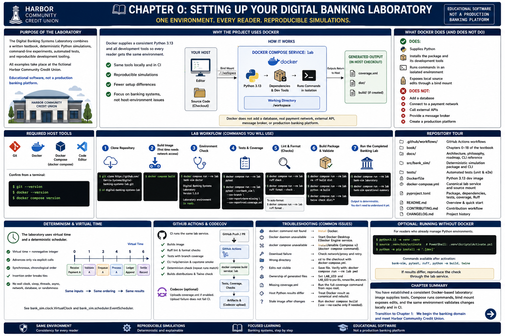

# Chapter 0: Setting Up Your Digital Banking Laboratory



## Purpose of the laboratory

The Digital Banking Systems Laboratory combines a written textbook, deterministic
Python simulations, command-line experiments, automated tests, and reproducible
development tooling. The examples take place at the fictional **Harbor Community
Credit Union** and are educational software, not a production banking platform.

Chapter 0 establishes a trustworthy environment before the learning sequence
introduces banking behavior. The laboratory should behave the same way for every
reader. Docker packages the Python version and development tools with the project
so the book can focus on banking systems rather than host-environment differences.

## Why the project uses Docker

A Python project depends on more than its source: a particular Python version,
package dependencies, pytest, Ruff, Build, Twine, and other development tools all
affect results. Installing and updating each tool separately on every host can
produce inconsistent behavior.

Docker supplies this project's Python 3.13 environment and dependencies. Docker
Compose provides the canonical `lab` command runner. Local development and GitHub
Actions therefore use the same environment. Docker is not merely a deployment
option here; it is part of the educational contract: every reader gets the same
tools, reproducible simulations, and fewer setup differences.

## What Docker does—and does not do

For this repository, Docker:

- supplies Python;
- installs the package and its development tools;
- runs commands in an isolated environment; and
- exposes local source edits through a bind mount.

It does **not** add a database, real payment network, external API, message broker,
or production banking platform. Volume I remains deterministic, in-memory,
single-process educational software.

## Required host tools

Install only these host tools:

- Git;
- Docker;
- Docker Compose through the `docker compose` command; and
- a code editor.

> You do not need to install Python, pip, pytest, Ruff, Build, or Twine on the host.

Confirm the host tools from a terminal:

```bash
git --version
docker --version
docker compose version
```

## Clone the repository

```bash
git clone https://github.com/Garcia-Systems/digital-banking-systems-lab.git
cd digital-banking-systems-lab
```

Run the remaining commands from this directory. The repository's Compose
configuration is `docker-compose.yml`, and its canonical service is `lab`.

## Build the image

```bash
docker compose build
```

The first build generally needs network access to download the Python 3.13 base
image and development packages. Docker caches completed layers, so later builds
normally reuse unchanged downloads. Changes to `Dockerfile` or `pyproject.toml`
generally require another build.

## Check the laboratory

```bash
docker compose run --rm lab bank-sim doctor
```

Current output is:

```text
Digital Banking Systems Laboratory
Version 1.0.0
Laboratory environment is ready.
```

`docker compose run` creates a one-off container, `--rm` removes that container
afterward, `lab` selects the service, and the rest is the command run inside it.

## Check CLI help and version

```bash
docker compose run --rm lab bank-sim --help
docker compose run --rm lab bank-sim --version
```

Help inventories the experiments. The version command prints `bank-sim 1.0.0`.

## Run the tests and coverage

Run the test suite:

```bash
docker compose run --rm lab pytest
```

Run the same branch-coverage command used by CI:

```bash
docker compose run --rm lab pytest \
  --cov=bank_sim \
  --cov-branch \
  --cov-report=term-missing \
  --cov-report=xml:coverage.xml
```

The XML report is written to `coverage.xml` in the host checkout because the
checkout is mounted into the container. Coverage data and reports are transient
generated files; regenerate them rather than treating them as source.

## Run linting and formatting checks

```bash
docker compose run --rm lab ruff check .
docker compose run --rm lab ruff format --check .
```

The second command only verifies formatting. When you deliberately want Ruff to
rewrite files, use:

```bash
docker compose run --rm lab ruff format .
```

Review formatting changes before committing them.

## Build and validate the package

Remove stale distributions, build fresh ones, and validate their metadata:

```bash
docker compose run --rm lab rm -rf build dist
docker compose run --rm lab python -m build
docker compose run --rm lab twine check dist/*
```

The `dist/` and possible `build/` directories are generated output in the mounted
checkout, not source files.

## Run the completed banking laboratory

Volume I is complete, so the environment can launch its capstone commands now:

```bash
docker compose run --rm lab bank-sim laboratory
docker compose run --rm lab bank-sim operational-summary
```

You do not need to understand the banking output yet. These commands simply prove
that the completed repository is executable; Chapters 1–18 introduce the concepts
in sequence.

## Determinism and virtual time

Financial-system behavior must be explainable. A simulation teaches most clearly
when the same inputs always create the same ordering and observations. The
laboratory represents virtual time as a nonnegative integer and advances it only
through explicit calls. Its scheduler runs callbacks synchronously in chronological
event order and uses insertion order to break equal-time ties.

No wall clock, sleep, thread, asynchronous runtime, network, database, or randomness
controls this foundation. Those boundaries keep causality visible; they do not
claim that real banking systems avoid distributed infrastructure. Read
`bank_sim.clock.VirtualClock` and `bank_sim.scheduler.EventScheduler`, then trace
their focused tests to see these contracts execute.

## GitHub Actions and Codecov

The CI workflow builds `docker-compose.yml` and runs the same `lab` service used
above. It performs Ruff linting and formatting verification, tests with branch
coverage, verifies `coverage.xml`, runs CLI help/version/capstone smoke checks,
compares repeated capstone output for determinism, builds distributions, and runs
Twine validation.

CI may upload `coverage.xml` to Codecov. Normal readers need no Codecov account,
token, or configuration to clone and use the laboratory. Repository owners who
enable uploads manage the `CODECOV_TOKEN` GitHub secret separately; an upload
failure is configured not to fail the laboratory validation job.

## Repository tour

```text
.github/workflows/   GitHub Actions workflows
book/                Chapters 0–18 of the textbook
docs/                Architecture, philosophy, roadmap, and CLI reference
src/bank_sim/        Deterministic simulation package and CLI
tests/               Focused and end-to-end automated tests
Dockerfile           Python 3.13 development image
docker-compose.yml   Canonical lab service and source mount
pyproject.toml       Package, dependency, test, coverage, and Ruff configuration
README.md            Project overview and Docker-first quick start
CONTRIBUTING.md      Contribution workflow
CHANGELOG.md         Published project history
```

## How source mounting works

`docker-compose.yml` maps `.:/workspace` and sets `/workspace` as the working
directory. A file saved in the local checkout is immediately visible at the same
relative path inside the container, so ordinary source or documentation edits do
not require rebuilding the image. Rebuild after dependency or Dockerfile changes.

The service runs as `${LAB_UID:-1000}:${LAB_GID:-1000}`. Generated files such as
`coverage.xml` and `dist/*` appear in the host checkout and normally use that mapped
identity.

## Troubleshooting

- **`docker: command not found`:** install Docker for the host operating system,
  reopen the terminal, and rerun `docker --version`.
- **Docker daemon unavailable:** start Docker Desktop or the Docker Engine service,
  then retry `docker compose build`.
- **`docker compose` unavailable:** install or enable the Compose v2 plugin. This
  project uses `docker compose`, not the legacy `docker-compose` executable.
- **Image or package download failure:** verify network/proxy access and retry the
  build. A completed cached layer does not need downloading again.
- **Wrong directory:** `cd` to the checkout containing `docker-compose.yml` before
  running Compose commands.
- **Source edits do not appear:** save the file, confirm the bind mount with
  `docker compose run --rm lab pwd`, and ensure you are editing this checkout.
- **Generated-file ownership:** set `LAB_UID` and `LAB_GID` to your numeric host
  identity if its IDs are not 1000, remove the affected generated files, and rerun.
- **Missing `coverage.xml`:** run the full coverage command above from the repository
  root; plain `pytest` intentionally does not create the XML report.
- **Host-Python results differ from Docker or CI:** treat the Docker Compose result
  as canonical and rebuild before investigating differences.
- **Stale image after dependencies change:** run `docker compose build` again (use
  `docker compose build --no-cache` only when normal cache invalidation is
  insufficient).

## Optional: running without Docker

This optional path is for readers who already manage Python development
environments. It is not required and is not more authoritative than Docker or CI.

```bash
python3.13 -m venv .venv
. .venv/bin/activate
python -m pip install -e '.[dev]'
```

On Windows PowerShell, activate with `.venv\Scripts\Activate.ps1`. After activation,
the shorter `bank-sim`, `pytest`, `ruff`, `python -m build`, and `twine` commands are
available. If their results differ, reproduce the check through the `lab` service.

## Chapter summary

You have established a consistent Docker-based laboratory: the image supplies
Python and development tools, Compose runs commands through `lab`, the bind mount
exposes edits, and the same environment validates changes locally and in CI. The
next section adds a second way to learn from that environment: observing the
simulation as it executes.

At this point in the book's learning sequence, banking behavior has not yet been
introduced. The completed checkout does contain the later Volume I implementation;
Chapter 0 simply keeps it outside the current teaching scope.

## Transition to Chapter 1

Chapter 1 begins the banking domain by distinguishing banks from credit unions and
introducing Harbor Community Credit Union as a member-owned institution.

# Debugging the Laboratory

The command-line experiments in this book are **Run Mode**. They answer **“What happened?”** by showing a deterministic result. The debugger provides **Debug Mode**. It answers **“How did it happen?”** by pausing the same program so that you can follow requests, decisions, ledger records, and projections as they are created.

Debugging is therefore part of the laboratory's educational experience, not just a way to repair broken programs. Reading source code shows the instructions a banking system _might_ execute. Watching execution shows which instruction runs next, which data it receives, and how one state leads to another. That distinction matters in financial software: the final balance is important, but so is the explainable chain of events that produced it.

Run Mode and Debug Mode are complementary. First run an experiment to see its stable business outcome. Then debug it to connect each line of output to the code and banking objects responsible for that outcome. Debugging does not change the inputs, rules, or deterministic behavior; it only gives you time to observe them.

## Two places to run commands

The command depends on whether your terminal is outside or inside the laboratory.

### Workflow A: from the host computer

In a normal terminal on your own computer, start commands with Docker Compose:

```bash
docker compose run --rm lab bank-sim deposit
```

Your host terminal is outside the reproducible Python environment. Docker Compose creates a container from the laboratory image, runs the command in the `lab` service, and removes that one-off container afterward.

### Workflow B: inside the Dev Container

In VS Code after choosing **Reopen in Container**, run the command directly:

```bash
bank-sim deposit
```

Do not add `docker compose run --rm lab` here. The integrated terminal is already inside the reproducible `lab` environment, with the package and its tools installed. Starting another Compose container would add an unnecessary container between you and the program you are learning. Throughout this section, commands shown without the Compose prefix are commands for the Dev Container terminal.

## Set up VS Code and the Dev Container

No previous VS Code or debugging experience is required.

1. Install [Visual Studio Code](https://code.visualstudio.com/) for your operating system.
2. In VS Code, open the **Extensions** view (the four-block icon on the left), search for **Dev Containers** by Microsoft, and select **Install**. Docker must also be running on the host.
3. Choose **File > Open Folder…** and open the cloned `digital-banking-systems-lab` repository—the folder containing `docker-compose.yml`.
4. Open the Command Palette with **View > Command Palette…**, type `Dev Containers: Reopen in Container`, and select that command.
5. Wait while VS Code builds and opens the container. The first build can take several minutes. When it is ready, the lower-left remote indicator identifies the Dev Container and the Explorer shows the repository at `/workspace`.
6. Open **Terminal > New Terminal** and verify the installed command:

   ```bash
   bank-sim --help
   ```

   A list of laboratory commands confirms that this terminal is inside the container. If the command is missing, make sure the container finished building and that VS Code says it is connected to the Dev Container before retrying.

The repository selects `/usr/local/bin/python` and installs VS Code's Python debugging support in the container. You do not need to select a host Python interpreter or install `debugpy` yourself.

## Meet Run and Debug

Select the **Run and Debug** icon (a triangle with a small bug) in VS Code's left Activity Bar. You can also choose **View > Run**. At the top of that panel, the configuration list describes prepared ways to start the project. Select **Debug: Post One Deposit**. Press **F5**, or select the green start triangle, to launch it.

A **breakpoint** tells the debugger, “pause before executing this line.” The pause lets you inspect the banking state before the next change occurs. To add one, open a source file and click the margin just to the left of its line number; a red dot appears. Click that dot again to remove the breakpoint. You can also put the text cursor on a line and press **F9** to toggle it. Removing a breakpoint does not remove or change any source code.

## Control the simulation while it is paused

When a breakpoint pauses the program, a small debug toolbar appears. Its controls let you choose how much banking behavior to observe next:

- **Continue (F5)** resumes normal execution until another breakpoint or the end of the experiment. Use it after you have understood a state and want to reach the next important banking event without walking through every intervening line.
- **Step Over (F10)** executes the current line and pauses at the next line in the same function. Use it to watch a request become an entry or a balance projection change while treating lower-level details as one operation.
- **Step Into (F11)** follows a function called by the current line. Use it when an operation such as `ledger.append(...)` is itself the lesson and you want to see its validation and append-only rules rather than treating it as a black box.
- **Step Out (Shift+F11)** finishes the current function and pauses in the function that called it. Use it after examining a ledger rule so you can return to the larger deposit, transfer, or payment workflow without stepping through the rest of that helper.
- **Restart** stops the current run and immediately begins the same launch configuration again. Use it to revisit a transition from its deterministic starting state, perhaps after moving a breakpoint or adding a Watch expression.
- **Stop** ends the debug session. Use it when the observation is complete or you started the wrong configuration. Stopping early ends only that experiment; it does not reverse or alter repository files.

The exact function-key behavior can depend on a laptop's keyboard settings. The same actions are always available from the debug toolbar and VS Code menus.

## Read the state of the banking system

While execution is paused, the Run and Debug panel provides several views. Expand values with the arrow beside them; hovering over a name in the editor also shows its current value.

- **Locals** contains names belonging to the paused function. This is usually the best starting point: a deposit function may show its `request`, `ledger`, and sequence number, while a retry worker may show the current attempt counter.
- **Globals** contains module-level names shared outside the current function, such as imported classes and constants. Globals provide context, but the current customer request is normally in Locals.
- **Call Stack** is the path of function calls that brought execution to this line. It connects the CLI experiment to the business workflow and then to the ledger operation. Select a frame to inspect what that earlier function knew at the time; return to the top frame before stepping again.
- **Watch** repeatedly evaluates expressions that you choose. Select **+** in the Watch view and enter a safe expression such as `request.amount_cents`, `len(ledger.entries)`, or `ledger.entries`. A Watch is useful when a balance, queue length, or retry count matters across several steps. Prefer expressions that only read state; do not call functions that change the simulation.

Across later chapters, these views will expose `DepositRequest` and other request objects before acceptance, immutable ledger entries after posting, payment queues before and after workers consume them, and projections that calculate balances from recorded facts. You will also inspect revisions and ordering information, retry counters, and dead-letter queues. The names change with the banking lesson, but the question remains the same: _what fact or decision exists at this exact point in the workflow?_

## First Debugging Exercise: Follow One Deposit

This exercise uses the existing **Debug: Post One Deposit** configuration. It runs the same `deposit` CLI experiment as Run Mode, but pauses inside its real implementation. Complete it only after VS Code has reopened in the Dev Container.

### 1. Open the deposit workflow

In the Explorer, open `src/bank_sim/deposits.py`. Find `post_deposit` and the line:

```python
sequence = len(ledger.entries) + 1
```

This function is the boundary where a validated customer request becomes a permanent financial fact. Starting here keeps the first exercise focused on that transition.

### 2. Set the breakpoint

Click the margin beside the `sequence` line (currently line 64) so that a red dot appears. The debugger will pause _before_ calculating the next ledger sequence. That timing matters: you can see the ledger before the deposit changes it.

### 3. Launch the debugger

Open **Run and Debug**, select **Debug: Post One Deposit**, and press **F5**. When the highlighted line appears, the program is paused—not frozen or broken. The CLI has already constructed the example request and ledger, but posting has not yet created a ledger entry.

### 4. Observe the request before it becomes a fact

Expand **Locals**, then expand `request`. Notice its deposit identifier, account identifier, amount in integer cents, and description. This `DepositRequest` represents what the customer asked the system to do. It is not yet proof that the money was posted. Also expand `ledger` and its `entries`; the empty collection confirms that no permanent ledger fact exists yet.

Add `request.amount_cents` and `len(ledger.entries)` to **Watch**. Keeping both in view connects the requested amount to the number of authoritative records without confusing the request with the result.

### 5. Step through the ledger operation

Press **F10** once to calculate `sequence`. Then use **F11** on the `ledger.append(...)` call. If VS Code first enters construction of `LedgerEntry` or `Money`, use **Step Out** or continue stepping until you reach `Ledger.append` in `src/bank_sim/ledger.py`.

Observe the completed `LedgerEntry`: it has its own entry identifier, the request's account and amount, a `CREDIT` type, and ordering fields. Then follow the append operation. This is why stepping into the call matters: you are watching an immutable financial record pass the ledger's rules and become authoritative, not merely watching a balance variable increase. Use **Shift+F11** to return to `post_deposit` after you have seen the append.

Back in `post_deposit`, `len(ledger.entries)` in Watch is now `1`. Expand the first entry. The request described an intention; this entry records the accepted fact from which a balance can later be replayed.

### 6. Watch the result object get returned

Step to the `return Deposit(...)` statement. Use **F10** to execute it. VS Code may briefly show the returned value in the editor or VARIABLES view before moving back to the caller. Inspect it when available: the `Deposit` has status `POSTED` and summarizes the workflow result, while the corresponding ledger entry remains the authority. Keeping those roles separate prevents application status objects from silently replacing financial history.

### 7. Continue the experiment

Press **F5** to continue. With no later breakpoint, the command finishes and the integrated terminal displays the experiment. A finished debug session is expected; the debugger has stopped observing, but the program completed normally.

### 8. Compare Debug Mode with Run Mode

In the Dev Container terminal, run:

```bash
bank-sim deposit
```

Compare its request, posted status, ledger entry, and final balance with the output from the debug session. They should match exactly. Run Mode gave you a concise, repeatable answer to **“What happened?”** Debug Mode showed **how** the customer's request became an immutable credit and how that fact supported the reported balance. Later Debugging Laboratory sections build on these same skills to explain queues, projections, revisions, retries, and dead-letter handling rather than asking you to trust only their final output.
