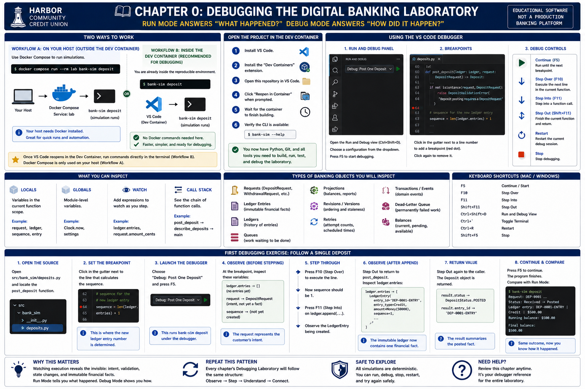

# Chapter 0: Setting Up Your Digital Banking Laboratory




## Purpose of the laboratory

The Digital Banking Systems Laboratory combines a textbook, deterministic Python
simulations, tests, and reproducible development tooling. Its examples concern the
fictional **Harbor Community Credit Union** and are educational software, not a
production banking platform.

Docker is the reproducibility foundation: it supplies Python 3.13, the package,
pytest, Ruff, Build, Twine, and the other development dependencies. The VS Code
Dev Container uses that Docker environment while providing the normal interactive
learning experience. The working model throughout this book is:

- **Host terminal:** manage Git and Docker.
- **Dev Container terminal:** run simulations, tests, linting, packaging, and
  experiments directly.
- **VS Code debugger:** step through simulations and inspect program state.

The simulations remain deterministic, in-memory, synchronous educational models.
Docker does not add a database, payment network, external API, or production
banking infrastructure.

## 1. Install the host prerequisites

Install these four tools on the host computer:

- Git;
- Docker with Docker Compose v2 (`docker compose`);
- Visual Studio Code; and
- the **Dev Containers** extension for VS Code.

You do **not** need host installations of Python, pytest, Ruff, Build, Twine, or
`bank-sim`. Docker supplies them.

## 2. Clone and maintain the repository on the host

Open a normal host terminal and run:

```bash
git clone https://github.com/Garcia-Systems/digital-banking-systems-lab.git
cd digital-banking-systems-lab
git status
git pull
```

Git is normally used outside the Dev Container for this project. Perform routine
branch, checkout, commit, merge, and pull operations from a host terminal opened
in the repository folder. The checkout is mounted into the Dev Container, so a
host-side Git change or file edit immediately appears in VS Code.

## 3. Verify Docker and build the environment on the host

From the host repository folder, run:

```bash
docker --version
docker compose version
docker compose build
```

The first build may download the Python base image and packages. Docker caches
unchanged layers. Rebuild after changes to `Dockerfile` or `pyproject.toml`.
Both the Dev Container and host-side Compose commands use the same `lab` service,
so Docker keeps learning, troubleshooting, and CI-equivalent checks reproducible.

## 4. Open the normal interactive laboratory

1. Open the cloned repository folder in Visual Studio Code.
2. Open the Command Palette and run **Dev Containers: Reopen in Container**.
3. Wait for the image to build and the environment to initialize. The lower-left
   remote indicator identifies the Dev Container when it is ready.
4. Choose **Terminal > New Terminal**. This terminal is inside `/workspace` in the
   container and is the normal interactive laboratory environment.

The repository is bind-mounted at `/workspace`; saved files remain in the host
checkout and are immediately visible on both sides.

## 5. Verify the Dev Container

Run these commands directly in the Dev Container terminal:

```bash
python --version
bank-sim --help
pytest --version
ruff --version
```

If a command is missing, confirm that initialization finished and that VS Code is
connected to the Dev Container. Git is not part of this in-container verification
or the supported reader workflow.

## 6. Use the laboratory

### Beginner learning loop

Run experiments directly—do not add a Compose prefix inside the Dev Container:

```bash
bank-sim institution
bank-sim deposit
pytest
ruff check .
```

Chapters 1–18 introduce the experiments in sequence. The same inputs produce the
same ordering and observations: virtual time advances only explicitly, and no wall
clock, network, concurrency, or randomness controls the foundation.

### Advanced validation and packaging

These direct commands are useful when contributing or preparing a release, but
they are not required for a beginner's first run:

```bash
ruff format --check .
python -m build
twine check dist/*
```

Build artifacts in `build/` and `dist/` are generated files in the mounted checkout.

## 7. Learn in Run Mode and Debug Mode

**Run Mode** answers **“What happened?”** Run a direct `bank-sim` command and
observe its stable result. **Debug Mode** answers **“How did it happen?”** Select a
prepared launch configuration, set a breakpoint, and press **F5** to pause the same
simulation and inspect its state.

The repository's `.vscode/launch.json` contains prepared chapter-specific launch
configurations. For a first exercise:

1. Run `bank-sim deposit` in the Dev Container terminal.
2. Open `src/bank_sim/deposits.py` and find `post_deposit`.
3. Set a breakpoint at the recognizable operation that calculates the next ledger
   sequence, before the entry is appended.
4. In **Run and Debug**, select **Debug: Post One Deposit** and press **F5**.
5. Inspect **Variables**, **Call Stack**, and `request`, `ledger`, and
   `len(ledger.entries)` before stepping.
6. Use Step Over to follow the local flow, Step Into to inspect the ledger append,
   Step Out to return, and Continue to finish.
7. Compare the debugger state and final output with the direct CLI result.

The request expresses intent; the appended ledger entry is the authoritative fact.
Watching that transition demonstrates why Debug Mode complements the concise Run
Mode result. See the [debugging guide](debugging.md) for the reusable chapter
workflow and the complete launch-configuration inventory.

## 8. Host-side Docker Compose alternatives

Compose remains useful for readers who do not use VS Code, independent container
validation, CI-equivalent execution, and troubleshooting. Run these alternatives
from the **host repository folder**:

```bash
docker compose run --rm lab bank-sim institution
docker compose run --rm lab pytest
docker compose run --rm lab ruff check .
docker compose run --rm lab python -m build
```

Do **not** run `docker compose` from inside the current Dev Container. It is already
the reproducible environment. These host commands are alternatives and validation
tools, not the normal chapter workflow.

For a CI-equivalent coverage report, maintainers can run:

```bash
docker compose run --rm lab pytest --cov=bank_sim --cov-branch \
  --cov-report=term-missing --cov-report=xml:coverage.xml
```

## Troubleshooting

- **Docker is unavailable:** install or start Docker Desktop/Docker Engine, then
  retry the host-side version and build commands.
- **Compose is unavailable:** install or enable Compose v2; this project uses
  `docker compose`, not the legacy `docker-compose` executable.
- **VS Code does not reopen:** ensure Docker is running and the Dev Containers
  extension is installed, then inspect the Dev Container build log.
- **Source edits do not appear:** confirm that VS Code opened the checkout which
  contains `docker-compose.yml` and that the workspace is `/workspace`.
- **Dependencies changed:** rebuild with `docker compose build` from the host. Use
  `--no-cache` only when ordinary cache invalidation is insufficient.
- **Generated-file ownership differs:** set `LAB_UID` and `LAB_GID` to the host's
  numeric identity before running host-side Compose validation.

## Optional: direct host-Python workflow

Experienced readers may choose to maintain Python 3.13 independently. This path is
secondary and is not equivalent to the Docker-backed Dev Container:

```bash
python3.13 -m venv .venv
. .venv/bin/activate
python -m pip install -e '.[dev]'
```

On Windows PowerShell, activate with `.venv\Scripts\Activate.ps1`. If host-Python
results differ, reproduce the check in the Dev Container or through the host-side
`lab` Compose service.

## Repository tour and next step

```text
.devcontainer/       VS Code Dev Container definition
.vscode/             Prepared debugger launch configurations
book/                Chapters 0–18 of the textbook
docs/                Architecture, roadmap, and CLI reference
src/bank_sim/        Deterministic simulation package and CLI
tests/               Focused and end-to-end automated tests
Dockerfile           Python 3.13 development image
docker-compose.yml   Reproducible lab service and source mount
```

Chapter 1 begins the banking domain by distinguishing banks from credit unions and
introducing Harbor Community Credit Union as a member-owned institution.
