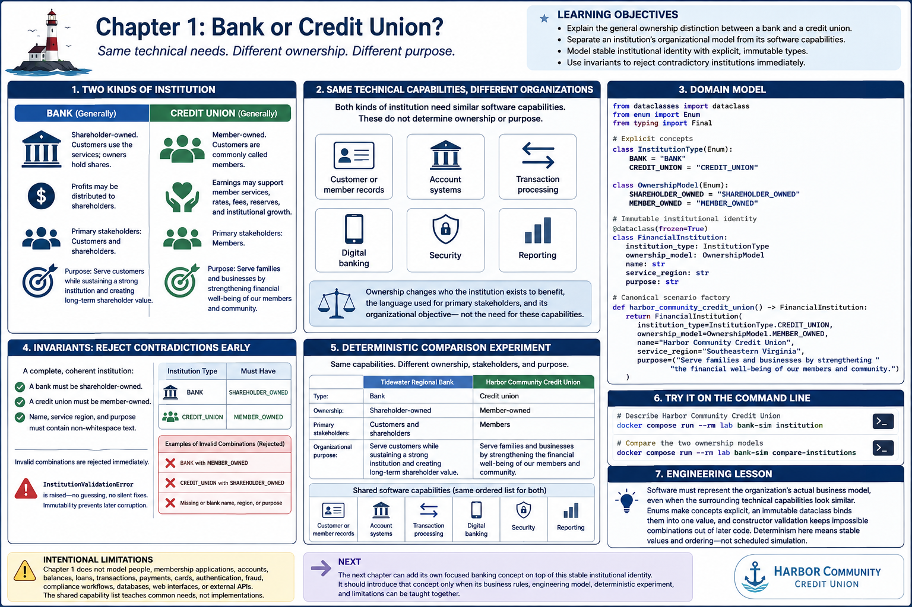

# Chapter 1: Bank or Credit Union?



## Learning objectives

After this chapter, you should be able to:

- explain the general ownership distinction between a bank and a credit union;
- separate an institution's organizational model from its software capabilities;
- model stable institutional identity with explicit, immutable types; and
- use invariants to reject contradictory institutions immediately.

This is an educational comparison, not legal, regulatory, investment, or financial
advice. Individual institutions vary in their governance, priorities, and services.

## Harbor Community Credit Union

Our continuing fictional institution is **Harbor Community Credit Union**, a
growing regional credit union serving families and businesses across southeastern
Virginia. In this chapter it is only an institution. There are no individual
members, accounts, products, or money movements.

Its concise fictional purpose is to serve families and businesses by strengthening
the financial well-being of its members and community.

## What banks and credit unions have in common

Both kinds of institution may need software for customer or member records,
account systems, transaction processing, digital banking, security, and reporting.
Those labels identify broad capabilities, not implementations supplied by this
chapter. Similar technical needs do not make the organizations identical.

## Shareholder ownership

A bank is generally shareholder-owned. Customers use its services, while owners
hold shares. Profits may be distributed to shareholders, and strategic priorities
may include shareholder return. This general description does not say that every
bank makes the same choices.

## Member ownership

A credit union is generally member-owned, and its customers are commonly called
members. It operates for the benefit of its membership. Earnings may support
member services, rates, fees, reserves, and institutional growth. This does not
claim that every credit union allocates earnings or governs itself identically.

## Organizational, not primarily technological

Ownership changes who the institution exists to benefit, the language used for
primary stakeholders, and its stated organizational objective. It does not remove
the need to keep records, offer secure channels, process activity, or report on
operations. The comparison therefore holds the high-level capability list constant
and changes the organizational description.

## The domain model

`InstitutionType` distinguishes `BANK` from `CREDIT_UNION`.
`OwnershipModel` distinguishes `SHAREHOLDER_OWNED` from `MEMBER_OWNED`.
The frozen `FinancialInstitution` dataclass combines those concepts with a name,
service region, and purpose. These fields describe stable institutional identity;
they do not describe changing financial state.

The `harbor_community_credit_union()` factory is the canonical scenario. A factory
returns a fresh immutable value without exposing a mutable global object.

## Invariants and invalid combinations

Construction succeeds only for a complete, coherent institution:

- a bank must be shareholder-owned;
- a credit union must be member-owned; and
- name, service region, and purpose must contain non-whitespace text.

`InstitutionValidationError` is raised immediately when one of these rules is
broken. The model neither guesses the caller's intent nor silently changes input.
Immutability prevents a valid institution from later being changed into an invalid
one.

## The deterministic comparison

The experiment creates fictional Tidewater Regional Bank and Harbor Community
Credit Union from in-process constants. It uses no clock, scheduler, random value,
external data, network, database, threads, or asynchronous processing. Both receive
the same ordered tuple of capability labels. Their ownership, stakeholder terms,
and purposes remain different, so repeated executions produce identical output
without erasing the business distinction.

## Try the command line

Commands in this book are intended to be run from the Dev Container introduced in Chapter 0.

Describe Harbor Community Credit Union:

```bash
bank-sim institution
```

Expected output:

```text
Harbor Community Credit Union
Institution type: Credit union
Ownership model: Member-owned
Service region: Southeastern Virginia
Purpose: Serve families and businesses by strengthening the financial well-being of our members and community.
```

Compare the two ownership models:

```bash
bank-sim compare-institutions
```

Expected output:

```text
Institution ownership comparison

Tidewater Regional Bank
Type: Bank
Ownership: Shareholder-owned
Primary stakeholders: Customers and shareholders
Organizational purpose: Serve customers while sustaining a strong institution and creating long-term shareholder value.

Harbor Community Credit Union
Type: Credit union
Ownership: Member-owned
Primary stakeholders: Members
Organizational purpose: Serve families and businesses by strengthening the financial well-being of our members and community.

Shared software capabilities:
- Customer or member records
- Account systems
- Transaction processing
- Digital banking
- Security
- Reporting
```

## Engineering lesson

> Software must represent the organization's actual business model, even when the
> surrounding technical capabilities look similar.

Enums make the available concepts explicit, an immutable dataclass binds them into
one value, and constructor validation keeps impossible combinations out of later
code. Determinism here means stable values and ordering; it does not require a
scheduled simulation.

## Intentional limitations

Chapter 1 does not model people, membership applications, accounts, account
numbers, balances, ledgers, deposits, withdrawals, loans, interest, payments,
cards, authentication, fraud, compliance workflows, databases, web interfaces, or
external APIs. The shared capability list teaches common needs; it is not a set of
placeholder implementations.

## Next

The next chapter can add its own focused banking concept on top of this stable
institutional identity. It should introduce that concept only when its business
rules, engineering model, deterministic experiment, and limitations can be taught
together.

## Debugging Laboratory

### Goal

Observe institution type and ownership as explicit, immutable domain identity, including the invariant that rejects contradictory pairings.

### Open the Source

Open `src/bank_sim/institutions.py`. Find `compare_institutions` and `FinancialInstitution.__post_init__`, where each constructed institution is validated.

### Set the Breakpoint

In `FinancialInstitution.__post_init__`, set a breakpoint on `required = _REQUIRED_OWNERSHIP.get(self.institution_type)`. The text fields have already been checked, but `required` does not exist until this highlighted assignment executes and the type/ownership comparison occurs later.

### Launch the Debugger

Select **Debug: Compare Institutions**. It runs `compare-institutions`, constructing the shareholder-owned bank and then the member-owned credit union.

### Observe

At the first pause, inspect `self`: its frozen fields identify Tidewater Regional Bank, `InstitutionType.BANK`, and `OwnershipModel.SHAREHOLDER_OWNED`. `_REQUIRED_OWNERSHIP` maps banks to shareholder ownership and credit unions to member ownership. There is no `required` local yet. The frozen, slotted dataclass prevents later reassignment of identity fields.

### Step Through

1. Step Over the lookup. `required` appears as `OwnershipModel.SHAREHOLDER_OWNED`; `self` is unchanged.
2. Step through the identity comparison. It agrees, so construction completes. Continue to the second pause and observe `InstitutionType.CREDIT_UNION` paired with `OwnershipModel.MEMBER_OWNED`.
3. Inspect the following contradictory-pairing guard: if `self.ownership_model is not required`, it raises `InstitutionValidationError` before an invalid object can be returned. Do not change the running scenario merely to trigger it; the guard and tests demonstrate the rejected path.
4. Continue. The CLI prints both distinct ownership models followed by the capabilities they share.

### Engineering Observation

Institutional identity is explicit domain state. It cannot be inferred from shared capabilities such as accounts, transaction processing, or digital banking; enforcing the type/ownership pairing prevents a contradictory identity from entering the system.
