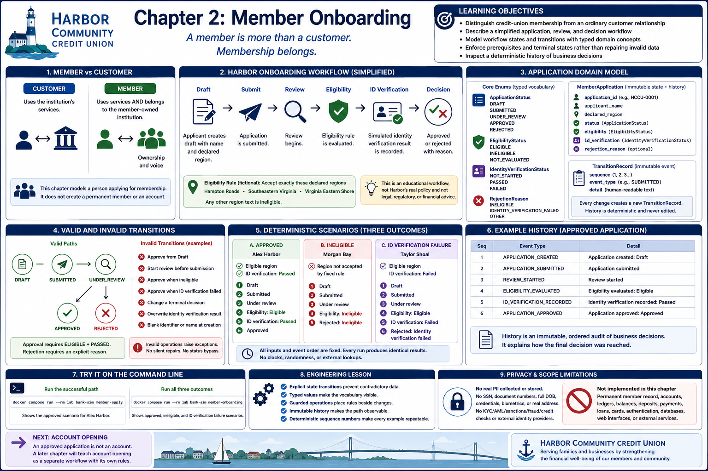

# Chapter 2: Member Onboarding



## Learning objectives

After this chapter, you should be able to:

- distinguish credit-union membership from an ordinary customer relationship;
- describe a simplified application, review, and decision workflow;
- model workflow states and transitions with typed domain concepts;
- enforce prerequisites and terminal states rather than repairing invalid data; and
- inspect a deterministic history of business decisions.

## A member is more than merely a customer

A customer uses an institution's services. A credit-union member also belongs to
the member-owned institution, subject to its eligibility and onboarding rules.
Chapter 1 modeled that ownership distinction at the institution level. This chapter
introduces a person applying for membership, but it does not create a permanent
member record or an account.

## The simplified Harbor workflow

For fictional Harbor Community Credit Union, a person creates a draft containing a
non-sensitive identifier, name, and declared region. The person submits it, a
review begins, a transparent eligibility rule is evaluated, and a simulated
identity-verification result is recorded. An eligible applicant with a passed
result can be approved; an ineligible applicant or failed result can be rejected
with an explicit reason.

This is an intentionally simplified educational workflow, not Harbor's real policy
and not legal, regulatory, financial, or compliance advice.

## Why explicit states matter

Without a workflow, independent fields could say that an application is both a
draft and approved, or approved despite a failed check. `ApplicationStatus`
defines `DRAFT`, `SUBMITTED`, `UNDER_REVIEW`, `APPROVED`, and `REJECTED`. Operations
move the application only along a permitted path and fail immediately otherwise.

## The application domain model

`MemberApplication` exposes identifying fields and read-only state while retaining
control of every change. `EligibilityStatus`, `IdentityVerificationStatus`, and
`RejectionReason` are enums rather than loosely interpreted strings.
`TransitionRecord` is an immutable event with a deterministic sequence number,
event type, and detail. The history reports creation, submission, review,
eligibility, identity verification, and the final decision. It uses no wall clock.

## Fictional eligibility evaluation

The fixed rule accepts exactly three generalized declared regions: `Hampton Roads`,
`Southeastern Virginia`, and `Virginia Eastern Shore`. Any other text is ineligible.
The deliberately exact comparison is deterministic and needs no geographic API,
ZIP-code data, network, or external lookup. It exists only to teach validation; it
must not be interpreted as any real credit union's field-of-membership policy.

## Identity-verification outcomes

The simulation records only `PASSED` or `FAILED`; `NOT_STARTED` describes the
initial state. It does not collect identity documents or personal identifiers and
does not contact an identity provider. A recorded result cannot be overwritten.

## Valid and invalid transitions

The two valid state paths are:

```text
DRAFT → SUBMITTED → UNDER_REVIEW → APPROVED
DRAFT → SUBMITTED → UNDER_REVIEW → REJECTED
```

Approval requires both `ELIGIBLE` and `PASSED`. Rejection requires an explicit
reason, and evidence-specific reasons require the matching result. A draft cannot
be approved, review cannot begin before submission, and neither terminal decision
can be changed. Blank identifiers and names are rejected at creation. No caller can
assign a public status to bypass these rules, and invalid operations raise clear
exceptions instead of silently repairing state.

## Deterministic scenarios

The successful scenario submits Alex Harbor's fictional application, starts review,
finds the declared Hampton Roads region eligible, records a passed simulated check,
and approves it. A second fictional applicant is rejected because the fixed rule
does not accept the declared region. A third is eligible but is rejected after a
failed simulated identity-verification result. All names, identifiers, and regions
are non-sensitive teaching data, and scenario and event order never vary.

## Try the command line

Run the successful path:

```bash
docker compose run --rm lab bank-sim member-apply
```

Expected output:

```text
Application: HCCU-0001
Applicant: Alex Harbor
State progression:
1. Application created: Draft
2. Application submitted: Submitted
3. Review started: Under review
4. Eligibility evaluated: Eligible
5. Identity verification recorded: Passed
6. Application approved: Approved
Eligibility: Eligible
Identity verification: Passed
Final decision: Approved
```

Run all three outcomes:

```bash
docker compose run --rm lab bank-sim member-onboarding
```

Expected output:

```text
Member onboarding outcomes

Approved application
Application: HCCU-0001
Applicant: Alex Harbor
State progression:
1. Application created: Draft
2. Application submitted: Submitted
3. Review started: Under review
4. Eligibility evaluated: Eligible
5. Identity verification recorded: Passed
6. Application approved: Approved
Eligibility: Eligible
Identity verification: Passed
Final decision: Approved

Ineligible application
Application: HCCU-0002
Applicant: Morgan Bay
State progression:
1. Application created: Draft
2. Application submitted: Submitted
3. Review started: Under review
4. Eligibility evaluated: Ineligible
5. Application rejected: Ineligible
Eligibility: Ineligible
Identity verification: Not started
Final decision: Rejected — Ineligible

Identity-verification failure
Application: HCCU-0003
Applicant: Taylor Shoal
State progression:
1. Application created: Draft
2. Application submitted: Submitted
3. Review started: Under review
4. Eligibility evaluated: Eligible
5. Identity verification recorded: Failed
6. Application rejected: Identity verification failed
Eligibility: Eligible
Identity verification: Failed
Final decision: Rejected — Identity verification failed
```

## Engineering lesson

> Important business workflows should be modeled as explicit state transitions,
> not as loosely related fields that can contradict one another.

Typed values make the vocabulary visible. Guarded operations place rules beside
changes. An immutable history makes the path observable. Deterministic inputs and
sequence numbers make every example repeatable.

## Privacy and scope limitations

Real onboarding has substantially more legal, regulatory, operational, privacy,
security, recordkeeping, and review requirements. This simulation stores no Social
Security number, government-document number, full birth date, credential,
biometric, or real address. It provides no KYC, AML, sanctions, fraud, credit, or
production identity-verification integration. It is not a blueprint for production.

## Intentionally unimplemented

There is no permanent member record, account opening, account number, ownership of
an account, ledger, balance, deposit, withdrawal, transfer, loan, interest, payment,
card, authentication, database, web interface, or external service. Approval is
only the final state of this application.

## Next: account opening

The approved result establishes only that this educational membership application
completed. A later chapter can teach account opening as a separate workflow with
its own domain rules. Keeping it deferred prevents membership approval from being
confused with creating or funding an account.

## Debugging Laboratory

### Goal

Observe guarded onboarding transitions, their ordered history, and both approved and explicitly rejected outcomes.

### Open the Source

Open `src/bank_sim/onboarding.py`. Find `MemberApplication.evaluate_eligibility`; the `member-onboarding` scenario reaches it once for each of three applications.

### Set the Breakpoint

Set a breakpoint on the assignment to `self._eligibility_status` inside `evaluate_eligibility`. The status guard has already confirmed `UNDER_REVIEW`, while eligibility is still `NOT_EVALUATED` and the eligibility-history record has not been added.

### Launch the Debugger

Select **Debug: Run Member Onboarding**, which runs the approved, ineligible, and failed-identity-verification paths.

### Observe

At each pause, inspect `self.status`, `self.eligibility_status`, `self.identity_verification_status`, `self.rejection_reason`, and `self.history`. The first application is `UNDER_REVIEW`, eligibility is `NOT_EVALUATED`, identity verification is `NOT_STARTED`, rejection reason is `None`, and history already contains creation, submission, and review-start records. The guarded calls that produced that history prevent skipped or repeated transitions.

### Step Through

1. Step Over the eligibility assignment. For Alex Harbor it becomes `ELIGIBLE`; the next `_record` call adds the fourth ordered event without changing application status.
2. Continue through identity verification and approval: identity becomes `PASSED`, status becomes `APPROVED`, and history ends with those explained transitions.
3. At the next pause Morgan Bay becomes `INELIGIBLE`; `reject(RejectionReason.INELIGIBLE)` later sets status to `REJECTED`, records that reason, and appends the rejection event.
4. Continue through Taylor Shoal: eligibility becomes `ELIGIBLE`, identity becomes `FAILED`, and the guarded rejection records `IDENTITY_VERIFICATION_FAILED`. The final CLI output shows all three histories.

### Engineering Observation

Explicit state transitions and immutable history snapshots prevent invalid, unexplained, or silently skipped onboarding outcomes. A decision is supported by the eligibility and identity facts that led to it, including a specific rejection reason.
