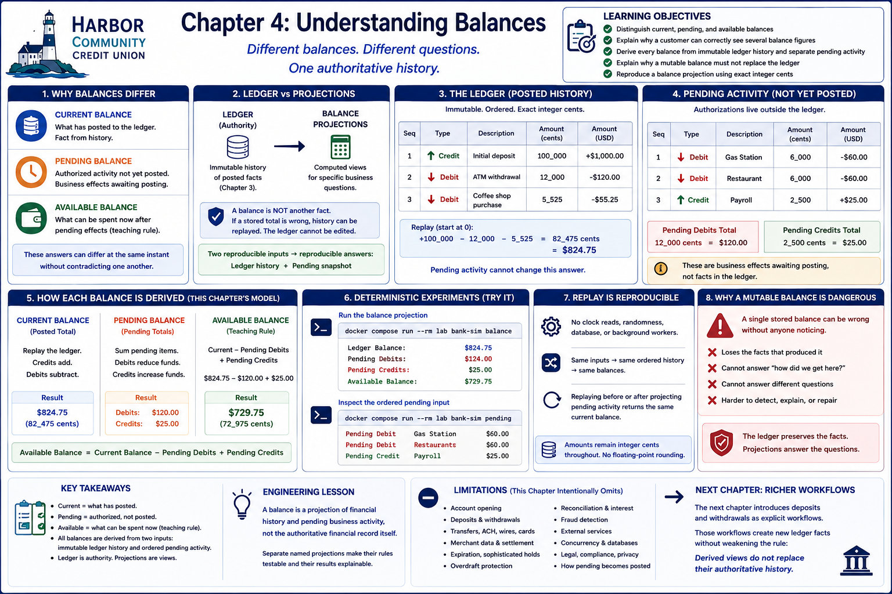

# Chapter 4: Understanding Balances



## Learning objectives

By the end of this chapter, you will be able to:

- distinguish current, pending, and available balances;
- explain why a customer can correctly see several balance figures;
- derive every balance from immutable ledger history and separate pending activity;
- explain why a mutable balance must not replace the ledger; and
- reproduce a balance projection using exact integer cents.

## Why balances differ

A financial institution does not have a single balance. Each balance answers a
separate business question. The **current balance** asks what has posted. The
**pending balance** describes authorized activity that has not posted. The
**available balance** estimates what can be spent immediately after pending effects.
These answers can differ at the same instant without contradicting one another.

## Ledger versus projections

The ledger remains the authoritative history. Its immutable entries say what has
posted, in sequence. A balance is a computed view of those facts—not another fact
to update. If a stored mutable total became incorrect, it could hide the history
needed to explain or repair it. Replay instead produces the same answer from the
same ordered entries.

Pending transactions live separately because authorization is not posting. They do
not append, edit, or delete ledger entries, and this chapter never posts them
automatically. Combining two reproducible inputs—ledger history and an ordered
pending snapshot—makes every displayed balance reproducible.

## Current balance

The current balance is the posted ledger total. Start at zero and replay each entry
in sequence: credits add exact integer cents and debits subtract them. Chapter 3's
fixed ledger replays as follows:

```text
+$1,000.00 - $120.00 - $55.25 = $824.75
```

Pending activity cannot change that answer.

## Pending balance

The deliberately small `PendingTransaction` model records an identifier, positive
integer-cent amount, debit-or-credit type, description, and deterministic sequence.
A pending debit reduces funds expected to be usable; a pending credit increases
them. The chapter scenario contains, in order:

```text
Pending Debit   Gas Station   $60.00
Pending Debit   Restaurant    $60.00
Pending Credit  Payroll       $25.00
```

Thus pending debits total $120.00 and pending credits total $25.00. These are
business effects awaiting posting, not ledger facts.

## Available balance

For this educational model only:

```text
Available Balance = Current Balance - Pending Debits + Pending Credits
$729.75 = $824.75 - $120.00 + $25.00
```

Real institutions may calculate available funds differently according to product
rules, regulation, risk controls, and transaction processing. This formula is a
transparent teaching rule, not production policy.

## Deterministic experiment

Run the projection repeatedly:

```bash
docker compose run --rm lab bank-sim balance
```

```text
Ledger Balance:        $824.75
Pending Debits:        $120.00
Pending Credits:        $25.00
Available Balance:     $729.75
```

Inspect the ordered pending input separately:

```bash
docker compose run --rm lab bank-sim pending
```

```text
Pending Debit
Gas Station
$60.00

Pending Debit
Restaurant
$60.00

Pending Credit
Payroll
$25.00
```

No clock, randomness, database, or background worker can alter these examples.
Amounts remain integer cents throughout, avoiding floating-point rounding. Empty
pending activity makes available equal current; several pending items aggregate in
sequence. Replaying the ledger before or after projecting pending activity returns
the same current balance.

## Engineering lesson

> A balance is a projection of financial history and pending business activity,
> not the authoritative financial record itself.

A single mutable number loses which facts produced it and which business question
it answers. Separate named projections make their rules testable and their results
explainable. Keeping pending activity outside the ledger also prevents an
authorization from masquerading as a posted fact.

## Limitations and next chapter

This simulation intentionally omits account opening, deposits, withdrawals,
transfers, merchant data, cards, ACH, wires, settlement, expiration, sophisticated
holds, overdraft protection, reconciliation, interest, fraud, and external
services. It does not model how pending activity becomes posted or disappears.
Those boundaries keep this lesson focused.

The next chapter can introduce deposits and withdrawals as explicit workflows.
Those workflows will create new ledger facts; they must not weaken the rule learned
here that balance views are derived rather than authoritative.

## Debugging Laboratory

### Goal

Observe posted history and pending activity feeding distinct current and available balance projections.

### Open the Source

Open `src/bank_sim/balances.py`. Find `project_balances`, which validates and totals pending activity before replaying the posted ledger.

### Set the Breakpoint

Set a breakpoint on `current = replay(ledger.entries)`. By this pause, the pending loop has completed: `debits` and `credits` exist, but `current` does not exist until the highlighted line executes and no `BalanceProjection` has yet been returned.

### Launch the Debugger

Select **Debug: Project Balances**, which runs the `balance` command with the fixed Chapter 3 ledger and Chapter 4 pending transactions.

### Observe

Inspect `ledger.entries`, `pending`, `debits`, and `credits`. Posted history is the immutable 100000-cent credit and 12000- and 5525-cent debits, producing 82475 cents. Pending activity remains separate: two 6000-cent debits and one 2500-cent credit produce `debits == 12000` and `credits == 2500`. `current` is not yet in scope.

### Step Through

1. Step Over replay. `current` appears as `82475`; neither ledger history nor pending transactions changed.
2. Step over the return and inspect the returned projection in the caller when VS Code exposes it: `current_balance=82475`, `pending_debits=12000`, `pending_credits=2500`, and `available_balance=72975`.
3. Continue. The CLI prints `$824.75`, `$120.00`, `$25.00`, and `$729.75` respectively.

### Engineering Observation

Pending activity can change available funds without becoming posted ledger history. Current balance comes only from authoritative entries, while available balance is a deliberately derived view that also reserves or anticipates pending effects.
