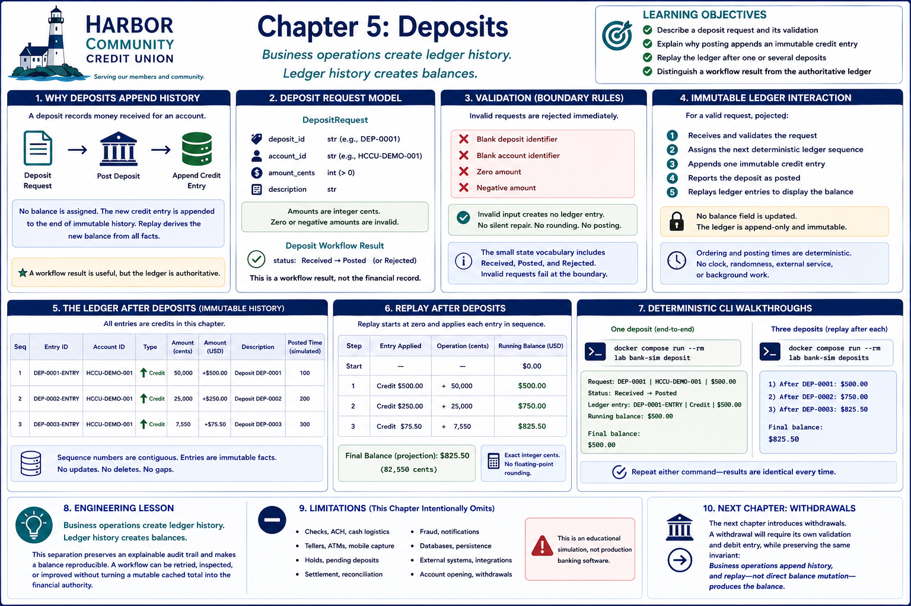

# Chapter 5: Deposits



## Learning objectives

By the end of this chapter, you will be able to:

- describe a deposit request and its validation;
- explain why posting appends an immutable credit entry;
- replay the ledger after one or several deposits; and
- distinguish a workflow result from the authoritative ledger.

## Why deposits append history

A deposit is a business request to record money received for an account. It does
not assign a new balance. Assigning a total would discard how the account reached
that total and could overwrite the effects of other operations. Posting instead
adds a fact to the end of history. The existing replay rule then derives the new
balance from all facts, old and new.

The `DepositRequest` carries a deposit identifier, account identifier, amount in
integer cents, and description. A successful workflow returns a `Deposit` with
`Posted` status, but that object is only a workflow result. The immutable credit
entry in the ledger is authoritative.

## Validation

The boundary immediately rejects a blank deposit identifier, blank account
identifier, zero amount, or negative amount with a clear validation exception.
Amounts must be integer cents. Invalid input creates no ledger entry: the example
does not silently repair, round, or post it. Although the small state vocabulary
includes `Received`, `Posted`, and `Rejected`, invalid requests fail at the boundary
rather than becoming posted deposits.

## Immutable ledger interaction

For a valid request, posting:

1. receives and validates the request;
2. assigns the next deterministic ledger sequence;
3. appends one immutable credit entry;
4. reports the deposit as posted; and
5. replays ledger entries to display the balance.

There is no balance field to increment. Entry identifiers derive from deposit
identifiers, and example ordering and posting times derive from ledger sequence;
there is no clock, random input, external service, or background work.

## Replay after deposits

With an empty ledger, posting $500.00 appends a $500.00 credit. Replay starts at
$0.00, applies that fact, and returns $500.00. Posting $250.00 and $75.50 afterward
does not edit either previous fact. Replay applies all three credits in sequence
and returns $825.50, with exact integer-cent precision.

## Deterministic CLI walkthroughs

Run one request from receipt through replay:

```bash
docker compose run --rm lab bank-sim deposit
```

```text
Request: DEP-0001 | HCCU-DEMO-001 | $500.00
Status: Received → Posted
Ledger entry: DEP-0001-ENTRY | Credit | $500.00
Running balance: $500.00

Final balance:
$500.00
```

Run all three requests and observe replay after each append:

```bash
docker compose run --rm lab bank-sim deposits
```

The running balances are `$500.00`, `$750.00`, and `$825.50`, in that order.
Repeating either command produces identical output.

## Engineering lesson

> Business operations create ledger history. Ledger history creates balances.

This separation preserves an explainable audit trail and makes a balance
reproducible. A workflow can be retried, inspected, or improved without turning a
mutable cached total into the financial authority.

## Debugging Laboratory

### Goal

Observe the boundary between a request to deposit money and the immutable ledger
fact that proves the deposit was posted. Then observe the balance being calculated
from that history. The lesson is that intent, an accepted financial fact, a
workflow result, and a balance projection are related objects, but they are not
interchangeable.

### Open the Source

Open `src/bank_sim/deposits.py` and find `post_deposit`. This function translates a
validated `DepositRequest` into a credit `LedgerEntry` and returns a `Deposit`
workflow result. Also keep `src/bank_sim/ledger.py` available: `Ledger.append`
enforces the append-only rules, and `replay` derives a balance from the entries.

### Set the Breakpoint

Inside `post_deposit`, set a breakpoint on the operation
`sequence = len(ledger.entries) + 1`. Use the operation rather than a line number,
because its meaning remains stable as prose and nearby code evolve.

The debugger will pause before the next sequence is calculated and before
`ledger.append(...)` runs. This is the important business boundary: the system has
a valid request representing intent, but it has not yet recorded a financial fact.

### Launch the Debugger

In **Run and Debug**, select the existing **Debug: Post One Deposit** configuration
and start it. This launches the same deterministic `deposit` scenario used in Run
Mode and pauses at the breakpoint in `post_deposit`; debugging changes only how
closely you observe the scenario, not its behavior.

### Observe

Before stepping, inspect these values in Locals or with side-effect-free Watch
expressions:

- `request` is a `DepositRequest` with deposit identifier `DEP-0001`, account
  identifier `HCCU-DEMO-001`, `amount_cents` equal to `50000`, and description
  `Initial deposit`. It represents intent, not yet a financial fact.
- `ledger` is the `Ledger` that will hold accepted facts. Observe
  `ledger.entries == ()` and `len(ledger.entries) == 0`: no entry supports a
  balance yet.
- `request.amount_cents` is an integer, not a floating-point dollar value. Exact
  cents avoid rounding ambiguity while the request moves through the workflow.

There is no `balance` local and no balance attribute to inspect on the request or
ledger. That absence is deliberate: this workflow does not assign a running total.

### Step Through

1. **Step Over** the sequence calculation. `sequence` becomes `1`, while
   `ledger.entries` remains empty. Ordering has been determined, but determining
   where a fact belongs is not the same as recording the fact.
2. At `ledger.append(...)`, **Step Into** the operation. Depending on where the
   debugger first pauses, it may show construction of `Money` or `LedgerEntry`;
   continue stepping into the call until `Ledger.append` in
   `src/bank_sim/ledger.py` is active. Inspect `entry`: it is
   `DEP-0001-ENTRY`, belongs to `HCCU-DEMO-001`, contains `Money(cents=50000)`,
   has type `EntryType.CREDIT`, and has sequence and posting time `1`. The request
   has not changed. A separate immutable record is being created from it.
3. **Step Over** the validation and append operations in `Ledger.append`. Before
   `_entries.append(entry)`, `self.entries` is still empty. After that operation,
   `self.entries` contains the entry; the entry's fields remain unchanged. The
   collection changed by gaining a fact, but the frozen `LedgerEntry` did not
   become a mutable balance record. **Step Out** to return to `post_deposit`.
4. At `return Deposit(...)`, **Step Over** to return to `describe_deposits`. The
   caller's `deposit` is now a `Deposit` whose status is `DepositStatus.POSTED`.
   Its identifiers, amount, and description agree with the request, and
   `ledger.entries` still contains exactly one authoritative entry. The returned
   object reports the workflow outcome; it does not replace or alter the ledger
   fact, and it has no `balance` attribute.
5. Step to `replay(ledger.entries)` in the `Running balance` expression and
   **Step Into** `replay` in `src/bank_sim/ledger.py`. Before its loop,
   `entries` contains the immutable credit and `balance` is `0`. **Step Over** one
   loop iteration: `direction` becomes `1`, then `balance` becomes `50000` while
   the entry and ledger remain unchanged. Replay reads history; it does not edit
   history.
6. **Continue** to finish. The terminal reports `$500.00`, the formatted form of
   the derived `50000` cents. This output is the result already visible in Run
   Mode; the laboratory has supplied the otherwise hidden chain that justifies it.

### Engineering Observation

A deposit request says what a customer wants to happen. Posting converts that
intent into a new, immutable credit fact and returns a separate result confirming
the workflow outcome. Only afterward does replay calculate the balance by reading
ledger history. The system never assigns `$500.00` directly to a balance field.

Financial systems preserve this separation so a reported balance can be explained
and reproduced from ordered evidence. If code instead overwrote a total, it could
erase how the money arrived, make concurrent changes harder to reconcile, and
weaken the audit trail. Append-only facts keep the financial history authoritative;
results and projections can be rebuilt from it.

## Limitations and transition to withdrawals

This chapter implements only immediately posted educational deposits. It omits
checks, ACH, cash logistics, tellers, ATMs, mobile capture, holds, pending deposits,
settlement, reconciliation, fraud, notifications, databases, and external systems.
It is not production banking software.

The next lesson can introduce withdrawals. A withdrawal will require its own
validation and debit entry, while preserving the same invariant: business
operations append history, and replay—not direct balance mutation—produces the
balance.
