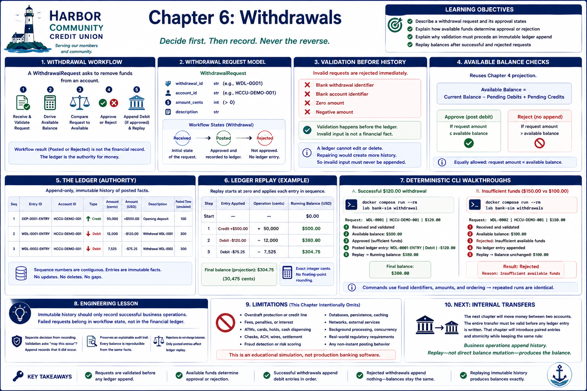

# Chapter 6: Withdrawals



## Learning objectives

By the end of this chapter, you will be able to:

- describe a withdrawal request and its approval states;
- explain how available funds determine approval or rejection;
- explain why validation must precede an immutable ledger append; and
- replay balances after successful and rejected requests.

## Withdrawal workflow

A `WithdrawalRequest` carries a withdrawal identifier, account identifier, amount
in integer cents, and description. Processing produces a `Withdrawal` whose status
is `Posted` or `Rejected`. `Received` names the request's initial workflow state.
The result describes a decision; the ledger remains the authority for money.

The intentionally small workflow is:

1. receive and validate the request;
2. derive available balance with the existing balance projection;
3. compare the requested amount with available funds;
4. reject without an append, or append one debit entry; and
5. replay the ledger.

## Validation before history

A blank withdrawal identifier, blank account identifier, zero amount, or negative
amount is rejected immediately. Amounts must be integer cents. These checks happen
before the ledger is touched. Invalid input is not a financial fact and therefore
must not become immutable financial history.

This ordering matters because an append-only ledger cannot repair a bad append by
editing or deleting it. A compensating entry would itself become history and would
misrepresent a request that should never have posted.

## Available balance checks

This chapter reuses the Chapter 4 projection. A request succeeds only when its
amount is less than or equal to available balance. For example, $120.00 requested
against $500.00 is posted and replay produces $380.00. Requesting exactly the
available amount is also allowed.

## Rejected requests

A $150.00 request against $100.00 is rejected deterministically with the reason
`Insufficient available funds`. The returned workflow state preserves that useful
decision, but no debit entry is appended. The ledger and its replayed balance remain
unchanged.

Rejection is not a debit followed by a correction. It is a decision made before
financial history exists.

## Ledger replay

Successful withdrawals append debit entries in deterministic sequence order. From
a $500.00 beginning balance, withdrawals of $50.00, $75.25, and $20.00 replay to
$354.75. Exact integer cents avoid floating-point rounding, and no object stores or
mutates a balance total.

A rejected withdrawal contributes no replay step. Replaying after rejection yields
the same result as replaying immediately before it.

## Deterministic CLI walkthroughs

Run a successful $120.00 withdrawal against $500.00:

```bash
docker compose run --rm lab bank-sim withdrawal
```

The output shows the request, validation, posted debit, replay, and final balance of
`$380.00`.

Run both a successful request and an insufficient-funds request:

```bash
docker compose run --rm lab bank-sim withdrawals
```

The rejected request reports `Insufficient available funds` and zero appended
entries. One final replay includes only the opening credit and successful debit.
Both commands use fixed identifiers, amounts, and ordering, so repeated runs match.

## Engineering lesson

> Immutable history should only record successful business operations. Failed
> requests belong in workflow state, not in the financial ledger.

Separating decision-making from recording prevents rejected activity from changing
balances and preserves an explainable ledger. Validation asks whether a business
operation may occur; append records that the approved operation did occur.

## Limitations

This simulation has no overdraft protection, credit line, fee, ATM, card hold,
cash dispensing, check, settlement, fraud detection, database, networking, or
background processing. It models only immediate educational decisions against an
existing balance projection and is not production banking software.

## Transition to internal transfers

An internal transfer will coordinate movement between two accounts while retaining
the same discipline: decide whether the complete operation is valid before writing
authoritative history. Transfers, including their atomicity and paired entries, are
intentionally deferred to a later chapter.

## Debugging Laboratory

### Goal

Observe available-funds approval and rejection without recording rejected intent.

### Open the Source

Open `src/bank_sim/withdrawals.py` and find `process_withdrawal`.

### Set the Breakpoint

Set a breakpoint on `available = project_balances(ledger, pending).available_balance`. The debugger pauses before the projection call: only `ledger`, `request`, and `pending` (plus the function arguments' validated state) are available; `available` does not exist yet.

### Launch the Debugger

Select **Debug: Process Withdrawals**. It runs one approved request followed by one rejected request.

### Observe

On the first call, `ledger` contains the 50000-cent opening credit, `pending` is empty, and `request.amount_cents` is `12000`. On the second call, the approved debit is already in the ledger and the request is for `40000`. Do not inspect `available` until after stepping over its assignment.

### Step Through

1. Step Over the projection on the first call. `available` appears as `50000`; the ledger is unchanged. The comparison is false, so a 12000-cent debit is appended and the result is `POSTED`.
2. Continue to the second call. Before projection the ledger already contains that debit. Step Over: `available` appears as `38000`.
3. The `40000 > 38000` comparison is true. Step through the early return: the result is `REJECTED` with `Insufficient available funds`. The ledger remains at two entries; no debit represents the rejected request.

### Engineering Observation

A rejection is workflow evidence, not a financial fact. Authoritative history contains only approved effects, so replay cannot mistake attempted spending for money that moved.
