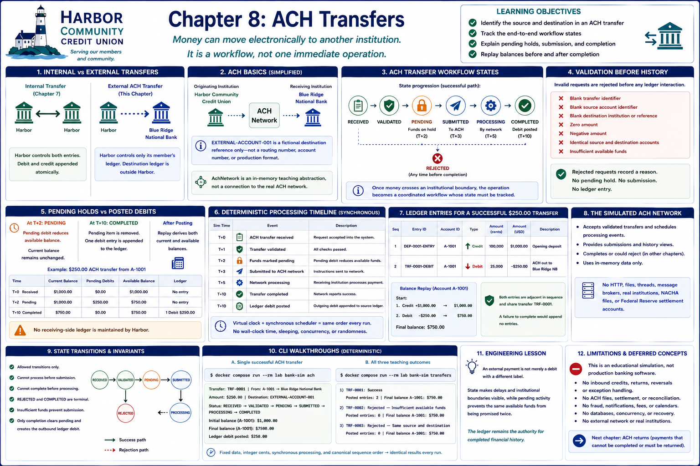

# Chapter 8: ACH Transfers



## Learning objectives

This chapter explains how money can move electronically from Harbor Community
Credit Union to another institution and why that movement is a workflow rather
than one immediate operation. You will follow payment instructions through
validation, a pending hold, submission, processing, and completion.

## Internal transfers versus external transfers

Harbor controls both ledger entries in Chapter 7's internal transfer, so it can
append the debit and credit atomically. For an outbound ACH credit, Harbor controls
only its member's ledger. It sends instructions toward the receiving institution
and records an external destination acknowledgment; it does **not** invent a Harbor
credit for an account at another institution.

## A simplified explanation of ACH

The Automated Clearing House (ACH) is a payment network through which financial
institutions exchange electronic payment instructions. In this laboratory, Harbor
is the originating institution and fictional Blue Ridge National Bank is the
receiving institution. `EXTERNAL-ACCOUNT-001` is only a fictional destination
reference—not a routing number, account number, or production payment format.

The small `AchTransferRequest` contains just the information needed for this
lesson. `AchNetwork` is an in-memory teaching abstraction, not a connection to the
real ACH network.

## Why workflow state matters

Harbor cannot atomically change another institution's ledger. It must retain what
it knows while responsibility crosses the boundary. The explicit progression is:

```text
RECEIVED → VALIDATED → PENDING → SUBMITTED → PROCESSING → COMPLETED
       └──────────────────────→ REJECTED
```

Once money crosses an institutional boundary, the operation becomes a coordinated
workflow whose state must be tracked over time.

## Validation and funds availability

Validation rejects blank transfer or source identifiers, blank destination
institution or reference, zero or negative amounts, and insufficient available
funds. A rejected request records a reason but creates no pending debit, network
submission, or ledger entry. Input is never silently repaired.

## Pending versus posted financial effects

This chapter chooses **pending debit followed by posting**. At T+2, a pending debit
reduces available balance while the $1,000.00 current balance remains unchanged.
At completion, the pending item is removed and one $250.00 debit is appended to the
authoritative ledger. Replay then derives both current and available balances of
$750.00. No receiving-side ledger is maintained by Harbor.

## Deterministic processing delays

The virtual clock and synchronous scheduler produce the same order every run:

```text
T+0    ACH transfer received
T+1    Transfer validated
T+2    Funds marked pending
T+3    Submitted to ACH network
T+5    Network processing
T+10   Transfer completed
T+10   Ledger debit posted
```

There is no wall-clock time, sleeping, concurrency, or randomness.

## The simulated ACH network

The in-memory network accepts the workflow after validation, schedules fixed
processing events, exposes submissions and history, and completes the payment. It
uses no HTTP, files, threads, message brokers, real institutions, NACHA files, or
Federal Reserve settlement accounts.

## State transitions and invariants

Allowed transitions are enumerated rather than assigned freely. A transfer cannot
process before submission or complete before processing. Rejected and completed
transfers are terminal. Insufficient funds prevent submission. Only completion
clears pending activity and creates the outgoing ledger effect.

## Duplicate-processing protection

A second completion attempts an invalid `COMPLETED → COMPLETED` transition before
any financial mutation. It fails immediately, so the ledger contains exactly one
outgoing debit. This is intentionally smaller than the comprehensive idempotency
and retry architecture reserved for later distributed-systems lessons.

## CLI walkthroughs

Run the successful scenario:

```bash
docker compose run --rm lab bank-sim ach
```

It shows the source, fictional destination, amount, initial and final balances,
status, and ledger debit. Its
successful scenario begins with $1,000.00, sends $250.00, and finishes at $750.00.

Print the exact timeline above:

```bash
docker compose run --rm lab bank-sim ach-timeline
```

Both commands are deterministic and covered by exact-output tests.

## Engineering lesson

An external payment is not merely a debit with a different label. State makes
delays and institutional boundaries visible, while pending activity prevents the
same available funds from being promised twice. The ledger remains the authority
for completed financial history.

## Privacy, regulatory, and operational limitations

Real ACH messages require substantially more structured and sensitive data and
operate under detailed legal, regulatory, security, authorization, formatting,
timing, settlement, exception, and operational rules. This educational simulation
contains no real account or routing numbers, personal data, credentials, external
network integration, sanctions screening, or claim of production suitability.

## Concepts intentionally deferred

Inbound credits, externally initiated debits, recurring payments, payroll, direct
deposit, same-day rules, calendars, cutoffs, settlement, reconciliation, fraud
controls, fees, notifications, reversals, prenotes, notices of change, and complete
retry/idempotency infrastructure remain out of scope.

## Transition to ACH returns

Completion is the final state in this simplified chapter. Real payment workflows
can later report that a payment could not be completed or must be returned. A
future chapter will introduce ACH returns explicitly; no return behavior or
placeholder is implemented here.

## Debugging Laboratory

### Goal

Observe an ACH instruction transition to pending, acquire a hold, and later become a posted debit.

### Open the Source

Open `src/bank_sim/ach.py` and find `AchNetwork._mark_pending`.

### Set the Breakpoint

Set a breakpoint on `transfer.transition(AchTransferStatus.PENDING, 2, "Funds marked pending")`. This pauses before the status transition and before pending-list insertion.

### Launch the Debugger

Select **Debug: Run ACH Timeline**.

### Observe

At virtual time `2`, `transfer.status` is `VALIDATED`, `self.pending` is empty, and the ledger contains only the 100000-cent opening credit. Current and available balances are both `100000`; no hold or ACH debit exists yet.

### Step Through

1. Step Over the transition. Status is now `PENDING`, while `self.pending` and the ledger are still unchanged.
2. Step Over `self.pending.append(...)`. One 25000-cent pending debit appears. Available balance becomes `75000`, current balance remains `100000`, and posted history remains unchanged.
3. Continue through submission and processing to `complete`: status becomes `COMPLETED`, the hold is removed, and a 25000-cent debit is appended. Current and available balances then both equal `75000`.

### Engineering Observation

A pending hold protects available funds while an external payment is unfinished, without claiming that settlement-like processing has already created a posted fact.
