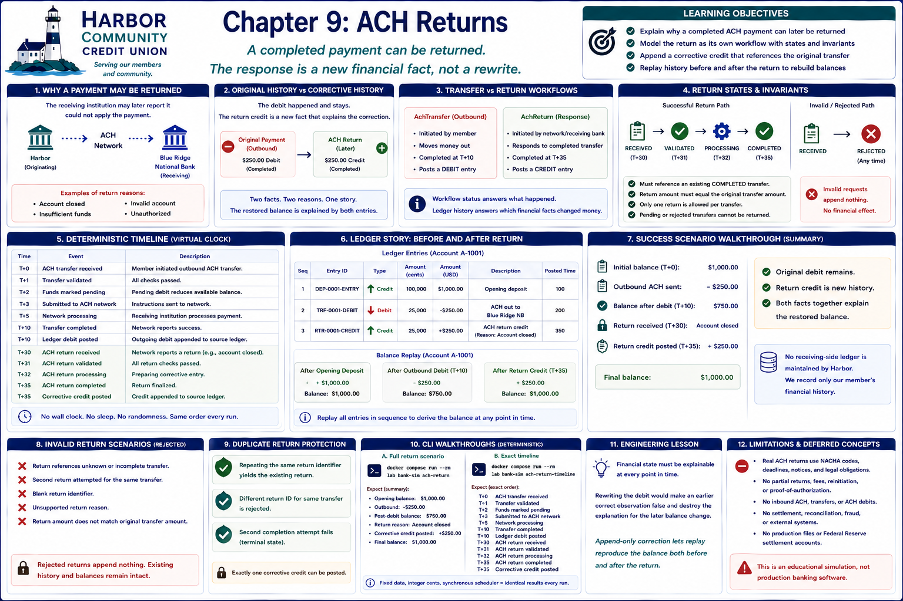

# Chapter 9: ACH Returns



## Learning objectives

This chapter explains why a completed external payment can later receive a return outcome and why the response must be a new financial fact. You will model a return as its own workflow, append a corrective credit, and replay both facts to rebuild the source balance.

## Why an external payment may later be returned

The receiving institution can later report that it could not apply an ACH payment. For example, the destination account may be closed or invalid. Completion in Chapter 8 records what Harbor knew then; it does not guarantee that no later external outcome can arrive.

## Original history versus corrective history

The $250.00 outbound debit really happened and remains immutable. A later $250.00 return credit is a second fact explaining the correction. The restored $1,000.00 balance does **not** mean the transfer disappeared.

> A correction does not erase a financial event. It appends new history that explains how the institution responded to that event.

## Separate transfer and return workflows

`AchTransfer` describes outbound initiation and posting. `AchReturn` references that completed transfer but has its own identifier, reason, status, timestamps, events, and corrective-entry identifier. Workflow status answers what happened to the business process; ledger history answers which financial facts changed money.

## Return states and invariants

The successful path is `RECEIVED → VALIDATED → PROCESSING → COMPLETED`; invalid requests take `RECEIVED → REJECTED`. Explicit guards prohibit skipped validation, processing after rejection, and repeated completion. A return must reference an existing completed transfer, equal its full amount, and be the only return for that transfer. A rejected or merely pending transfer cannot be returned. Rejected returns append nothing.

## Simplified return reasons

The typed reasons are account closed, invalid account, insufficient funds at the receiving institution, and unauthorized. They affect description, never amount. These labels are educational—not production NACHA codes. Every return here is full; partial returns are excluded.

## Deterministic timing

The virtual clock and scheduler produce:

```text
T+0    ACH transfer received
T+1    Transfer validated
T+2    Funds marked pending
T+3    Submitted to ACH network
T+5    Network processing
T+10   Transfer completed
T+10   Ledger debit posted
T+30   ACH return received
T+31   ACH return validated
T+32   ACH return processing
T+35   ACH return completed
T+35   Corrective credit posted
```

No wall clock, sleep, randomness, threads, or network is involved.

## Ledger correction and replay

The ledger begins with a $1,000.00 opening credit. Completion appends the original $250.00 debit, so replay produces $750.00. Return completion appends a distinct `ACH return credit` carrying references to both the original transfer and return. Replay of all three entries produces $1,000.00. The original entry is neither edited nor deleted, and the Chapter 8 pending hold is not recreated.

## Duplicate-return protection

Repeating the same return identifier yields its existing workflow. A different identifier for the same transfer is rejected. A second completion fails its terminal-state transition before appending. These focused invariants prevent multiple credits without a general idempotency platform.

## Invalid return scenarios

Unknown or incomplete transfers, a second return, blank identifiers, unsupported reasons, and mismatched amounts lead to deterministic rejection. Existing workflow, pending, and ledger state remains intact; no rejected return has a financial effect.

## CLI walkthroughs and expected output

Run the return scenario:

```bash
docker compose run --rm lab bank-sim ach-return
```

It shows the opening balance, outbound amount, $750.00 post-debit balance, return
reason, correction, preserved entries, and restored $1,000.00 balance.

See the exact timeline above:

```bash
docker compose run --rm lab bank-sim ach-return-timeline
```

Both outputs have exact deterministic tests.

## Engineering lesson

Financial state must be explainable at every point in time. Rewriting the debit would make an earlier correct observation false and destroy the explanation for the later balance change. Append-only correction lets replay reproduce the balance both before and after the return.

## Privacy, regulatory, and operational limitations

Real ACH returns involve standardized codes, deadlines, calendars, notices, documentation, authorization obligations, sensitive data, controls, and institution-specific responsibilities. This in-memory laboratory uses fictional references and makes no compliance or production-suitability claim.

## Concepts intentionally deferred

Partial returns, fees, notices of change, reinitiation, contested returns, proof-of-authorization, same-day rules, deadlines, business calendars, inbound ACH, ACH debit origination, retries, notifications, production files, fraud, AML, sanctions screening, settlement accounts, and Federal Reserve accounting remain out of scope.

## Transition to settlement and reconciliation

Returns show that external outcomes can correct completed-looking history. A later chapter will distinguish payment workflow from settlement and use reconciliation to compare internal records with external evidence. Neither settlement nor reconciliation is implemented here.
