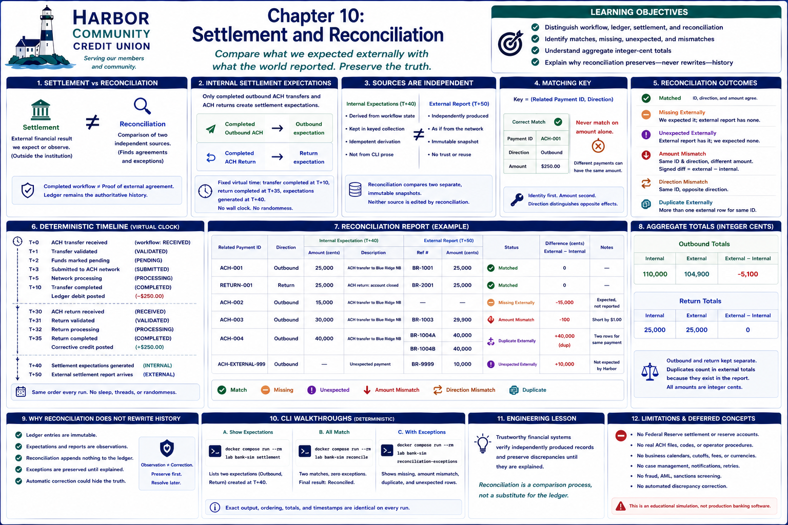

# Chapter 10: Settlement and Reconciliation



## Learning objectives

This chapter distinguishes a payment's workflow, its member-account ledger effects,
its expected external settlement, and the later comparison of that expectation with
an external report. You will identify matches and exceptions, understand aggregate
integer-cent totals, and see why investigation must preserve original history.

## Settlement versus reconciliation

**Settlement** is the external financial result of payment activity. Harbor's
`SettlementRecord` says what it expects that result to be. **Reconciliation** asks
whether an independently produced `ExternalSettlementReport` agrees. A completed
workflow is evidence of internal processing—not proof of external agreement.

The ledger remains posted member-account history. Settlement expectations do not
replace ledger entries, and a reconciliation status is not a payment status.

## Internal settlement expectations

Only a completed outbound ACH transfer produces an `Outbound` expectation, and
only a completed ACH return produces a `Return` expectation. Pending and rejected
workflows produce none. Expectations are derived from typed workflow state rather
than CLI prose. Keyed collection makes repeated derivation idempotent.

The fixed lesson uses virtual time: ACH completion occurs at T+10, return completion
at T+35, and expectations are generated at T+40. No wall clock or randomness is
involved.

## Simulated external reports

An `ExternalSettlementReport` is a separate immutable tuple of records assembled as
if supplied by the fictional network at T+50. It is deliberately constructed
independently; reconciliation would teach nothing if it merely trusted or reused
the internal objects. This model does not parse files or contact a network.

## Matching keys

The simplified matching key is `(related payment identifier, direction)`. Payment
identity is considered first so a row with the opposite direction can be diagnosed.
Amount alone is never a key: unrelated payments can have equal amounts.

## Matched records

Identity, direction, and integer-cent amount must agree for `Matched`. The matched
scenario has ACH-001 outbound $250.00 and RETURN-001 return $250.00 in both sources.

## Missing and unexpected records

`Missing externally` means Harbor expected a record but received none.
`Unexpected externally` means an external identity has no internal expectation.
Both remain visible in the report for investigation.

## Amount and direction mismatches

Equal identity and direction but unequal amounts produce `Amount mismatch`. The
signed convention is **external minus internal**: $299.00 externally versus $300.00
internally is -$1.00. Equal identity with `Outbound` versus `Return` produces
`Direction mismatch`.

## Duplicate external records

More than one external row sharing a payment identity produces `Duplicate
externally`. References are sorted so the diagnosis is repeatable. Stable
classification precedence is: **duplicate, direction mismatch, amount mismatch,
matched**. Thus duplicate wins even if one duplicate also has the wrong amount or
direction.

## Deterministic report ordering

Items sort by related payment identifier, then status text, then external reference.
External references within a duplicate are also sorted. Reports and their item
tuples are immutable.

## Aggregate totals

Outbound and return totals remain separate rather than being combined into a
misleading unsigned number. Each direction reports internal cents, external cents,
and `external - internal`. Duplicate rows count in the external total because that
is what the independent report actually contains. All arithmetic uses integers.

## Why reconciliation does not rewrite the ledger

Comparison is observation, not correction. Reconciliation does not change a
transfer, return, balance, ledger entry, or original expectation, and it appends no
balancing entry. Exceptions are retained until people can explain them. Automatic
resolution could conceal the very evidence an investigation needs.

## Try the command line

From the Dev Container terminal:

List the two expectations and their T+40 generation time:

```bash
bank-sim settlement
```

Print two matches, zero exceptions, separate direction totals, and `Final result:
Reconciled`:

```bash
bank-sim reconcile
```

Show ACH-002 missing, ACH-003 short by $1.00, ACH-004 duplicated, and
ACH-EXTERNAL-999 unexpected:

```bash
bank-sim reconciliation-exceptions
```

Run the commands repeatedly: wording, ordering, amounts, and timestamps remain
identical.

## Engineering lesson

**Trustworthy financial systems verify independently produced records and preserve
discrepancies until they are explained.** Reconciliation is a comparison process,
not a substitute for the ledger.

## Operational and regulatory limitations

This is an educational, in-memory model. It does not reproduce Federal Reserve or
reserve-account settlement, correspondent banking, NACHA operator procedures,
production payment formats, real general-ledger accounting, regulatory controls,
or operational security.

## Concepts intentionally deferred

File ingestion, business calendars, cutoffs, fees, multicurrency, suspense accounts,
case management, notification, retry infrastructure, distributed queues, fraud,
AML, sanctions screening, and automatic discrepancy correction remain out of scope.

## Transition to operational exception handling

We can now produce trustworthy, stable evidence of disagreement. A future chapter
may introduce controlled operational resolution; it must explain exceptions without
rewriting the evidence or silently changing financial history.

## Debugging Laboratory

### Goal

Observe expected internal settlement facts and actual external evidence being classified without changing either source.

### Open the Source

Open `src/bank_sim/settlement.py` and find `reconcile`.

### Set the Breakpoint

Set a breakpoint on `expected = internal_by_id.get(payment_id)`, inside the loop rather than on its header. At this pause the loop has assigned `payment_id`; `expected` and `actual` do not exist until their highlighted assignments execute.

### Launch the Debugger

Select **Debug: Reconcile Settlement**.

### Observe

Inspect `internal_by_id`, `external_by_id`, `items`, and the current `payment_id`. The indexed source snapshots are unchanged. Before Step Over there is no current `expected` or `actual`; `items` contains only earlier classifications.

### Step Through

1. Step Over the two assignments so `expected` is a `SettlementRecord` or `None` and `actual` is the sorted list of matching external rows.
2. Follow classification precedence. The enum defines the exact categories `MATCHED`, `MISSING_EXTERNALLY`, `UNEXPECTED_EXTERNALLY`, `AMOUNT_MISMATCH`, `DIRECTION_MISMATCH`, and `DUPLICATE_EXTERNALLY`; this exception workload exercises four of them.
3. Inspect the scenario's exact cents: `ACH-002` is `MISSING_EXTERNALLY` with 12500 expected and no actual row; `ACH-003` is `AMOUNT_MISMATCH` with 30000 expected and 29900 actual; `ACH-004` is `DUPLICATE_EXTERNALLY` with 5000 expected and two 5000 actual rows (10000 aggregated); `ACH-EXTERNAL-999` is `UNEXPECTED_EXTERNALLY` with no expected row and 8000 actual.
4. Continue through sorting and `status_totals`: `MATCHED` is 0 and the four exercised exception categories are each 1. Neither input snapshot changes.

### Engineering Observation

Reconciliation classifies disagreement from stable expected and actual facts; it does not “fix” the evidence it is responsible for comparing.
