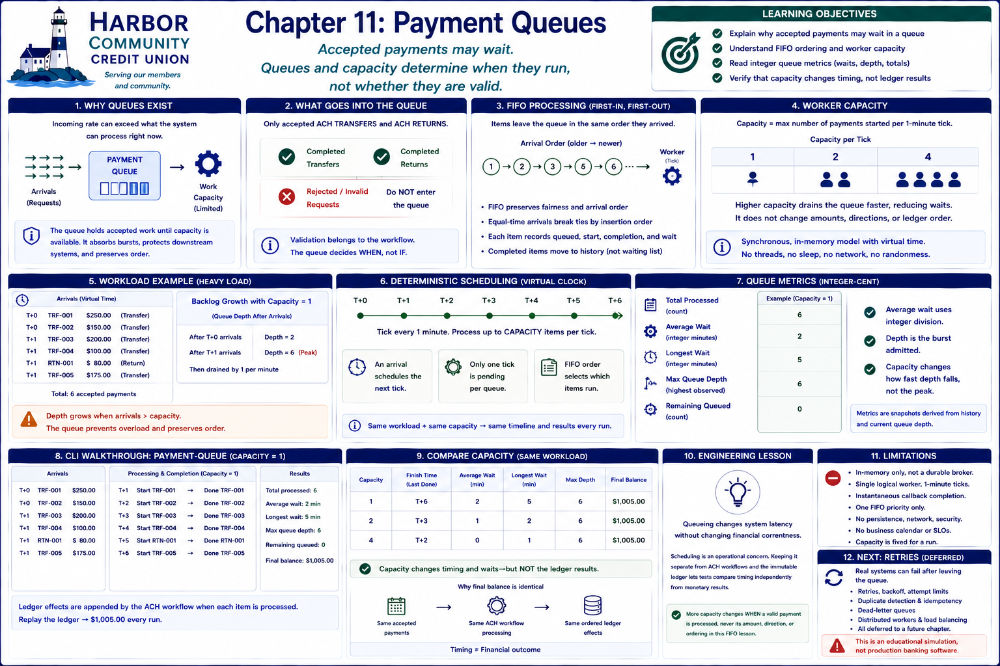

# Chapter 11: Payment Queues



## Learning objectives

This chapter explains why accepted payment requests may wait, how FIFO ordering and
worker capacity shape that wait, and how virtual time makes queued processing fully
repeatable. You will compare light and heavy loads, read integer queue metrics, and
verify that capacity changes completion time without changing ledger results.

## Why queues exist

A financial institution cannot process every payment immediately. Network windows,
finite service capacity, downstream limits, validation systems, and operational
controls all constrain throughput. A queue absorbs a temporary difference between
arrival rate and processing rate instead of pretending capacity is infinite.

This laboratory queues only already accepted ACH transfers and ACH returns.
Rejected requests never enter it. Validation remains the workflow's responsibility;
the queue decides **when** accepted work runs, not whether it is financially valid.

## FIFO processing

`PaymentQueue` appends each `QueuedPayment` and `QueueWorker` removes from the front.
This first-in, first-out rule preserves arrival order across transfers and returns.
When arrivals share a simulated instant, the existing `EventScheduler` insertion
order breaks the time tie, and the queue records a monotonic arrival order. There is
no random selection.

Each item records its queued time, original queue position, processing start,
completion, and integer wait duration. Completed work leaves the waiting collection
but remains observable in completion history for the lesson.

## Worker capacity

Capacity means the maximum number of payments started on each one-minute worker
tick. A capacity of one removes one FIFO item per tick; capacities two and four
remove up to two and four. Processing invokes the supplied ACH domain callback.
The queue does not calculate money, mutate balances directly, or reconcile results.

The model is synchronous. It uses no threads, `asyncio`, multiprocessing, sleeping,
or real timer. `VirtualClock` holds nonnegative integer time and `EventScheduler`
advances it explicitly.

## Backlog growth

Under light load, requests arrive more slowly than one worker can process them, so
depth returns to zero before the next arrival. Under heavy load, two requests arrive
at T+0 and four more at T+1. With capacity one, depth reaches six, one request
completes each minute, and the queue drains at T+6. The backlog is temporary but its
later items wait longer.

## Queue metrics

`QueueStatistics` reports total processed, integer average wait, longest wait,
maximum queue depth, and remaining queued items. Average wait uses integer division;
there is no floating-point simulated duration. Statistics are snapshots derived
from queue history and current depth, so repeating a workload produces equal values.

Maximum depth describes the burst admitted to this queue. Capacity changes how fast
that depth falls. A real monitoring system would also sample time-weighted depth,
arrival rates, and percentiles; those are intentionally beyond this chapter.

## Deterministic scheduling

An arrival wakes the worker by scheduling one tick at the next simulated minute.
Only one tick is pending for a queue. A tick processes no more than its configured
capacity and schedules the next tick only if work remains. Equal-time arrivals use
scheduler insertion order, while FIFO determines all later selection.

The supplied work callback is the boundary between scheduling and financial domain
logic. In the chapter workload, callbacks append the same ordered ACH debit and
return credit effects for every capacity. Therefore ledger replay produces the same
final balance even though entry timestamps differ.

## CLI walkthroughs

Run:

```bash
docker compose run --rm lab bank-sim payment-queue
```

The output lists all arrivals and queue sizes, followed by processing and completion
events at each virtual minute. Its final section shows six processed payments,
integer waits, maximum depth, an empty queue, and the replayed balance.

Then compare one workload without changing its instructions:

```bash
docker compose run --rm lab bank-sim payment-capacity
```

Capacity one finishes at T+6, capacity two at T+3, and capacity four at T+2. The
wait metrics fall as capacity rises. All three rows retain the same final balance,
and the command explicitly verifies identical ordered ledger effects.

## Engineering lesson

**Queueing changes system latency without changing financial correctness.**

Scheduling is an operational concern. Keeping it separate from ACH workflows and
the immutable ledger lets tests compare timing independently from monetary results.
More capacity changes when a valid debit or correction is performed, never its
amount, direction, or ordering in this FIFO lesson.

## Limitations

This is an educational in-memory queue, not a durable message broker. It has one
logical worker, fixed one-minute ticks, instantaneous callback completion, one FIFO
priority, and no persistence, network, security controls, business calendar,
service-level objectives, or production observability. Capacity is fixed for a run.

## Transition to retries

This chapter assumes accepted work completes when selected. Real processing can
fail after leaving a waiting state, raising questions about safe redelivery and
attempt limits. Retries, backoff, duplicate detection, idempotency, dead-letter
queues, failures, distributed workers, and load balancing are deliberately deferred.
The next lesson can introduce retries without confusing them with basic queueing.

## Debugging Laboratory

### Goal

Observe accepted payment work becoming decoupled from arrival time.

### Open the Source

Open `src/bank_sim/payment_queues.py` and find `QueueWorker._process_tick`. Follow calls into adjacent domain objects when stepping; this function is the chapter's clearest observation boundary.

### Set the Breakpoint

Set a breakpoint at the `popleft()` that dequeues work. This logical operation is more stable than a line number and pauses immediately before the chapter's important state transition.

### Launch the Debugger

Select **Debug: Process Payment Queue** in **Run and Debug** and start it. The configuration runs the chapter's deterministic CLI scenario, so debugging exposes the same execution described above.

### Observe

Inspect `self.queue._waiting`, `item`, `now`, `self.queue._completed`, `self.queue._events`, and the scenario ledger. Before stepping, expect the following: At the tick, accepted items wait in FIFO order, completed work excludes the next item, and its ledger effect has not happened.

### Step Through

Step over `popleft`: queue depth falls and `item` is the oldest arrival. Step over `item._work()`: the corresponding ledger effect appears. Completion time and the completed collection are then updated. Continue to see the queue drain in the same order.

### Engineering Observation

A queue separates request acceptance from execution. In production this absorbs uneven demand and changes latency without changing the ordered financial intent.
