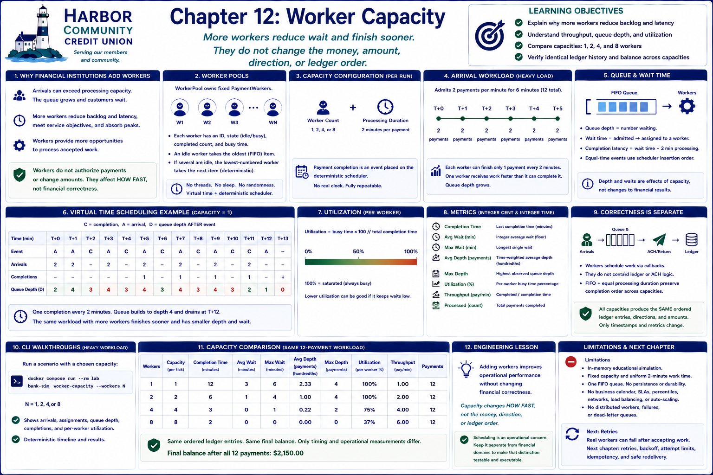

# Chapter 12: Worker Capacity



## Learning objectives

This chapter separates financial correctness from operational performance. You will
learn how worker pools, throughput, queue depth, utilization, and bottlenecks affect
completion latency while an identical accepted workload produces identical ledger
history.

## Why financial institutions add workers

A payment processor has finite capacity. When accepted payments arrive faster than
workers finish them, the waiting queue grows and customers wait longer. An institution
may add workers to reduce that backlog, meet service objectives, absorb predictable
peaks, and finish operational work sooner. More workers do not authorize a payment or
change its amount: they provide more opportunities to process already accepted work.

## Worker pools

`WorkerPool` owns fixed `PaymentWorker` instances. Each worker has a stable identifier,
an idle or busy state, completed-payment count, and accumulated busy time. An idle
worker takes the oldest waiting payment. When several workers are idle, the
lowest-numbered worker takes the next item. These simple rules make every assignment
reproducible.

`CapacityConfiguration` fixes the worker count and two-minute processing duration for
the run. The examples support one, two, four, or eight workers without threads,
`asyncio`, multiprocessing, sleeping, or real clocks. Completion is an event placed
on the existing deterministic scheduler.

## Throughput and bottlenecks

Throughput is completed payments divided by simulated elapsed time. The chapter
workload admits two payments per minute for six minutes, while each worker needs two
minutes per payment. One worker therefore receives work faster than it can complete
it. Queue depth and wait time grow, but the worker eventually drains all twelve items.

Two workers reduce the bottleneck and finish sooner, although a backlog remains. Four
workers nearly match the burst and keep waiting minimal. Beyond the bottleneck, extra
workers have diminishing benefit: eight workers cannot complete an item faster than
its fixed two-minute processing duration.

## Queue depth and wait time

Maximum queue depth captures the worst backlog. Average queue depth is time-weighted:
the simulation adds `depth × duration` whenever depth changes, then divides by total
completion time. It stores hundredths as an integer instead of relying on floating
point. Wait time runs from admission until worker assignment; completion latency also
includes processing time.

Arrivals scheduled at the same instant are admitted in scheduler insertion order.
If arrival and completion events share a time, the event scheduled first runs first.
This explicit rule explains short transient depths and prevents timing ambiguity.

## Utilization

Worker utilization is `busy time × 100 // total completion time`. A saturated worker
reports 100 percent. Added capacity can lower utilization because some workers have no
work while arrivals are still in progress. Low wait with lower utilization is not a
financial inconsistency; it is the operational tradeoff of spare capacity.

The comparison reports completion time, integer average and maximum wait, time-weighted
average and maximum depth, utilization, throughput, and payments processed. Metrics are
useful only when interpreted together: high utilization may accompany an unhealthy
backlog, while spare capacity may be intentional.

## Deterministic scheduling and financial correctness

Workers schedule supplied callbacks but do not contain ledger, ACH, reconciliation,
or validation rules. FIFO selection and equal processing durations preserve payment
completion order across capacities. Thus every run appends the same ordered entry
identifiers, directions, and amounts. Only timestamps and operational measurements
change.

## CLI walkthroughs

Run the heavy workload with a chosen pool:

```bash
docker compose run --rm lab bank-sim worker-capacity --workers 1
docker compose run --rm lab bank-sim worker-capacity --workers 2
docker compose run --rm lab bank-sim worker-capacity --workers 4
docker compose run --rm lab bank-sim worker-capacity --workers 8
```

The timeline shows arrivals, deterministic assignments, queue depth at each event,
completion order, and per-worker utilization. Then compare the required scenarios
side by side:

```bash
docker compose run --rm lab bank-sim capacity-comparison
```

All rows process the identical twelve-payment workload. Completion time, waits, depth,
and utilization differ; the final lines verify identical ledger history and balance.

## Engineering lesson

**Adding workers improves operational performance without changing financial
correctness.** Capacity determines how quickly accepted work completes, not whether
its financial result is correct. Keeping scheduling outside the financial domains
makes that distinction executable and testable.

## Limitations

This is an in-memory educational simulation with fixed capacity, uniform processing
time, one FIFO queue, and integer summary metrics. It does not model persistence,
business calendars, service-level percentiles, network limits, dynamic auto-scaling,
load-balancing algorithms, distributed workers, remote processing, failures, or
dead-letter queues.

## Transition to retries

Every selected callback succeeds exactly once in this chapter. Real workers can fail
after accepting an item, forcing a system to decide whether and how to attempt it
again without duplicating money movement. The next chapter can introduce retries,
attempt limits, backoff, and idempotency while retaining this deterministic capacity
foundation.

## Debugging Laboratory

### Goal

Observe a bounded worker pool assigning queued work without changing financial results.

### Open the Source

Open `src/bank_sim/worker_capacity.py` and find `WorkerPool._dispatch`. Follow calls into adjacent domain objects when stepping; this function is the chapter's clearest observation boundary.

### Set the Breakpoint

Set a breakpoint at the assignment to `worker.current_payment`. This logical operation is more stable than a line number and pauses immediately before the chapter's important state transition.

### Launch the Debugger

Select **Debug: Run Worker Capacity** in **Run and Debug** and start it. The configuration runs the chapter's deterministic CLI scenario, so debugging exposes the same execution described above.

### Observe

Inspect `self._waiting`, `self.workers`, `worker`, `item`, `self.scheduler.clock.time`, and `self._completed`. Before stepping, expect the following: With two workers, idle workers have no current payment and accepted items wait in arrival order. No item is complete merely because it has arrived.

### Step Through

Step over the dequeue and assignment, then inspect the scheduled completion. At `WorkerPool._complete`, step over `item._work()` and watch the completed collection and worker statistics change before `_dispatch` fills the newly idle slot.

### Engineering Observation

Capacity controls when work finishes, not what money movement means. Keeping worker utilization outside ledger semantics lets banks scale throughput without changing outcomes.
