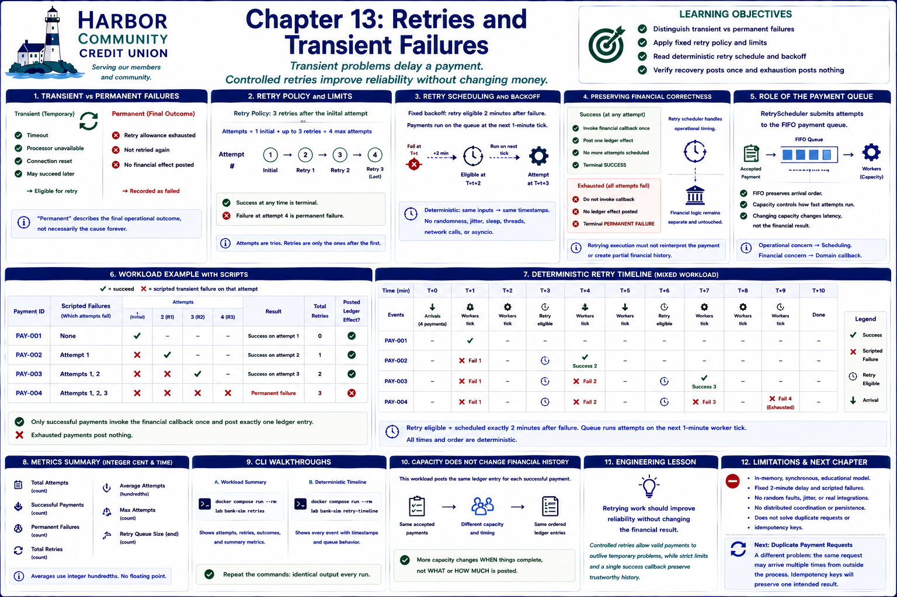

# Chapter 13: Retries and Transient Failures



## Learning objectives

This chapter explains why temporary operational trouble delays a payment rather than
immediately abandoning it. You will distinguish transient and permanent failures,
apply fixed retry policies and limits, read a deterministic retry schedule, and
verify that recovery does not duplicate a financial effect.

## Transient versus permanent failures

A timeout, temporarily unavailable processor, or reset connection may disappear on a
later attempt. These are **transient failures**: the accepted business instruction is
still valid, but an operational dependency could not complete it yet. Giving up at
once would turn a short outage into an avoidable customer failure.

A failure becomes permanent for this simulation when its retry allowance is
exhausted. “Permanent” describes the final operational outcome, not necessarily the
underlying cause forever. The payment records that outcome and creates no posted
financial effect.

## Retry policy and limits

`RetryPolicy` permits three retries after the initial attempt. A payment therefore
has at most four attempts. `RetryAttempt` records its number, time, reason, remaining
allowance, next scheduled time, and success. Success is terminal and no more work is
scheduled. A fourth transient failure is terminal and becomes permanently failed.

The distinction between **attempts** and **retries** matters: the first attempt is not
a retry. A retry limit prevents an unavailable dependency from creating endless work
and makes the final outcome explainable.

## Retry scheduling and deterministic backoff

`RetryScheduler` submits attempts to the Chapter 11 payment queue. When a scripted
failure occurs, it places a retry event exactly two simulated minutes later. The
queue then processes that item on its next one-minute tick. The fixed delay is a
simple deterministic backoff: identical inputs always produce identical timestamps.

No randomness, jitter, sleeping, wall-clock time, thread, network call, or `asyncio`
can change the result. Scenario failure scripts explicitly say which attempts fail
and why. This makes recovery behavior repeatable enough to teach and test.

## Preserving financial correctness

The retry scheduler owns operational timing, not ledger, balance, reconciliation, or
validation rules. It does not invoke the supplied financial callback on a scripted
failure. Once an attempt succeeds, it invokes that callback exactly once and stops.
Exhaustion never invokes it. Thus successful recovery creates one ledger entry and a
permanent failure creates none.

This separation models an important boundary: retrying execution must not reinterpret
the payment or append partial financial history. The scenario can prove that several
attempts still have one financial result.

## CLI walkthroughs

Run the mixed workload:

```bash
docker compose run --rm lab bank-sim retries
```

The report includes immediate success, one retry, two retries, and exhaustion. It
shows attempts, failures, retries, final outcomes, total retries, successful
recoveries, permanent failures, average and maximum attempts, and the final retry
queue size. Average attempts is computed in integer hundredths.

Inspect the stable event sequence:

```bash
docker compose run --rm lab bank-sim retry-timeline
```

A failure on an attempt at `T+1` schedules retry eligibility for `T+3`; queue
processing then performs the next attempt at `T+4`. Equal-time event insertion and
FIFO queue rules remain explicit, so mixed workloads reproduce the same order.

## Engineering lesson

**Retrying work should improve reliability without changing the financial result.**
Controlled retries allow a valid payment to outlive a temporary dependency problem,
while strict limits and a single success callback preserve trustworthy history.

## Limitations

This is an in-memory synchronous teaching model. It has a fixed delay and scripted
failures. It does not provide exponential backoff, jitter, random faults, durable or
distributed retry coordination, dead-letter queues, calendars, or real integrations.
It also deliberately does not solve duplicate requests or use idempotency keys.

## Transition to duplicate payment requests

This chapter prevents several attempts inside one retry process from posting more
than once. A later chapter must address a different problem: the same payment request
may arrive multiple times from outside the process. Duplicate detection and
idempotency keys will preserve one intended result across those separate requests.

## Debugging Laboratory

### Goal

Observe a transient failure scheduling bounded future work while preserving one intent.

### Open the Source

Open `src/bank_sim/retries.py` and find `RetryScheduler._enqueue_attempt`. Follow calls into adjacent domain objects when stepping; this function is the chapter's clearest observation boundary.

### Set the Breakpoint

Set a breakpoint at the branch that calls `self.scheduler.schedule_at(retry_time, retry)`. This logical operation is more stable than a line number and pauses immediately before the chapter's important state transition.

### Launch the Debugger

Select **Debug: Run Retries** in **Run and Debug** and start it. The configuration runs the chapter's deterministic CLI scenario, so debugging exposes the same execution described above.

### Observe

Inspect `payment`, `number`, `reason`, `retry_time`, `self.queue.queued`, `self._attempts`, and `self.scheduler.clock.time`. Before stepping, expect the following: Before the failing work runs, the payment has one intent and no successful financial effect. Its attempt count reflects only attempts already begun.

### Step Through

Step through the scripted-failure branch. Observe the failed attempt, incremented retry count, and a new queued attempt with later eligibility. Continue until success: outcome becomes `SUCCEEDED` and the callback posts once; exhausted work becomes `FAILED` instead.

### Engineering Observation

Retries preserve intent across temporary outages, but attempts are not additional payments. Bounded scheduling plus a single success effect prevents reliability machinery from multiplying money movement.
