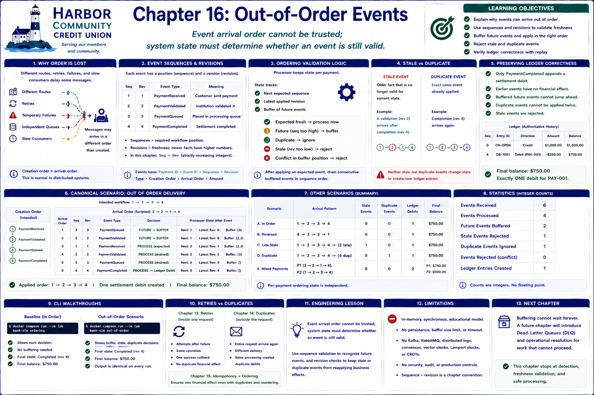

# Chapter 16: Out-of-Order Events



## Learning objectives

This chapter answers two questions. **Business:** why might payment-related events
arrive in a different order from the order in which they were created?
**Engineering:** how can software distinguish a valid late event from an invalid
stale event? You will use sequences and revisions, deterministic buffering, and
ledger replay to preserve financial history.

> **Event arrival order cannot be trusted; system state must determine whether an
> event is still valid.**

## Why distributed systems lose ordering

Different routes, retries, temporary worker failures, independent queues, and slow
consumers can delay one message while a later message continues. Even when a
producer creates validation before queueing, the queueing event can reach a consumer
first. This does not require a malicious sender or broken business workflow: message
delivery and business creation are different timelines.

The laboratory scripts those timelines. It uses no network, broker, concurrency, or
randomness. `creation_order` records the intended workflow while `arrival_order`
records the repeatable delivery script.

## Sequence numbers and revisions

Each `PaymentEvent` carries a payment identifier, unique event identifier,
`EventSequence`, `EventRevision`, event type, creation order, arrival order, and
amount. The teaching workflow is:

1. `PaymentReceived`;
2. `PaymentValidated`;
3. `PaymentQueued`;
4. `PaymentCompleted`.

Sequences express the required transition position. Revisions express freshness.
This deliberately small workflow uses equal sequence and revision values, making a
newer workflow fact strictly greater than the applied fact. Positive integer
validation and event-type validation prevent malformed scripts.

## Ordering validation

`OrderedEventProcessor` keeps ordering state separately for every payment. On each
delivery it compares the event with the state's next expected sequence and latest
revision:

- the expected fresh event is processed;
- a future event is buffered under its sequence;
- an event identifier already applied is a duplicate;
- an unrecognized event at an applied sequence or revision is stale;
- a conflicting event for an occupied buffer position is rejected.

After applying an expected event, the processor drains consecutive buffered events
in sequence order. Thus arrival `3 → 2 → 1 → 4` is observed exactly as delivered but
applied as `1 → 2 → 3 → 4`. Buffering is a documented deterministic policy, not a
claim that every production consumer must buffer.

## Stale events

A late event is not automatically valid. After completion at revision 4, a newly
identified validation event at revision 2 is obsolete. The processor records a
stale decision and does not apply it. If an already applied event identifier arrives
again, it records a duplicate decision. Neither case silently rewrites state.

The distinction matters: a duplicate says “this exact event was already applied,”
while stale says “this older fact is no longer valid for current state.” Reliable
payment systems validate event freshness before applying business effects.

## Deterministic demonstrations

The scenarios cover correct order, reversed delivery, a late superseded event, a
duplicate old event, and mixed payments with independent ordering state. There is no
clock race: identical event tuples always produce identical decisions, statistics,
and ledger entries.

Future events are counted when first buffered. They are counted as processed only
when their missing predecessors arrive and deterministic draining applies them.
Rejected, stale, and duplicate events remain visible in the decision history.

## Preserving ledger correctness

Ordering validation determines whether an event *may* reach business processing; it
does not replace ledger, idempotency, retry, or reconciliation rules. Only a fresh
`PaymentCompleted` event appends the settlement debit. Earlier workflow events have
no financial effect, buffered completion cannot jump ahead, and completed event
identifiers cannot be applied twice.

The canonical account opens at `$1,000.00`. One `$250.00` payment—whether delivered
in order or reversed—creates one settlement debit and ends at `$750.00`. A stale
validation and duplicate completion leave both immutable ledger history and replayed
balance unchanged. The ledger remains authoritative.

## Ordering statistics

`OrderingStatistics` reports integer counts for events received, processed, stale,
out of order, buffered, rejected, duplicate, and ledger entries created. In the
out-of-order CLI scenario, six deliveries yield four applied workflow events, two
future events buffered, one stale event, one duplicate, and exactly one settlement
entry.

## CLI walkthroughs

Run the baseline:

```bash
docker compose run --rm lab bank-sim ordering
```

It prints each sequence decision and the final completed state and `$750.00`
balance. Then run the disrupted delivery:

```bash
docker compose run --rm lab bank-sim out-of-order
```

It prints expected order, arrival order, buffer and rejection decisions, stale and
duplicate counts, final state, and the unchanged one-debit financial outcome. Both
commands produce byte-for-byte identical output on repeated runs.

## Engineering lesson

**Event arrival order cannot be trusted; system state must determine whether an
event is still valid.** Sequence validation lets a system recognize a future event,
while revision and event-identity checks keep stale or duplicate events from
reapplying business effects. Delivery order is evidence to inspect, never authority
to overwrite financial truth.

## Limitations

This is a synchronous, in-memory teaching processor. Its buffer has no persistence,
size limit, timeout, recovery, or cross-process coordination. It does not model
Kafka, RabbitMQ, distributed logs, consensus, vector clocks, Lamport clocks, CRDTs,
security, or production audit controls. Matching sequence and revision is a focused
chapter convention rather than a universal event-versioning design.

## Transition to dead-letter queues

Buffering cannot wait forever in a real system. An earlier event may never arrive,
or a malformed event may require investigation. A later chapter can introduce
dead-letter queues and operational resolution for work that cannot proceed. This
chapter intentionally stops at deterministic detection, freshness validation, and
safe processing.

## Debugging Laboratory

### Goal

Observe sequence, revision, and event identity deciding whether an arrival may advance state.

### Open the Source

Open `src/bank_sim/ordering.py` and find `OrderedEventProcessor.receive`. Follow calls into adjacent domain objects when stepping; this function is the chapter's clearest observation boundary.

### Set the Breakpoint

Set a breakpoint at the comparisons that buffer a future event or reject a stale revision. This logical operation is more stable than a line number and pauses immediately before the chapter's important state transition.

### Launch the Debugger

Select **Debug: Process Out-of-Order Events** in **Run and Debug** and start it. The configuration runs the chapter's deterministic CLI scenario, so debugging exposes the same execution described above.

### Observe

Inspect `event`, `state`, `expected`, `state.last_sequence`, `state.last_revision`, `self._buffers`, `self._processed_event_ids`, and `self.ledger.entries`. Before stepping, expect the following: The arriving event may be newer than the expected sequence even though it arrived now. Processor state—not arrival position—defines whether it can apply.

### Step Through

Step through a future event and see it enter `self._buffers[event.payment_id]` without a ledger effect. When the missing event applies, step into `_drain` and watch buffered work become eligible. Continue through stale and duplicate arrivals; their decisions change statistics, not workflow or ledger state.

### Engineering Observation

Deterministic ordering prevents late, duplicated, or stale messages from rewriting current truth. Production event consumers need state-based acceptance rules rather than trusting arrival order.
