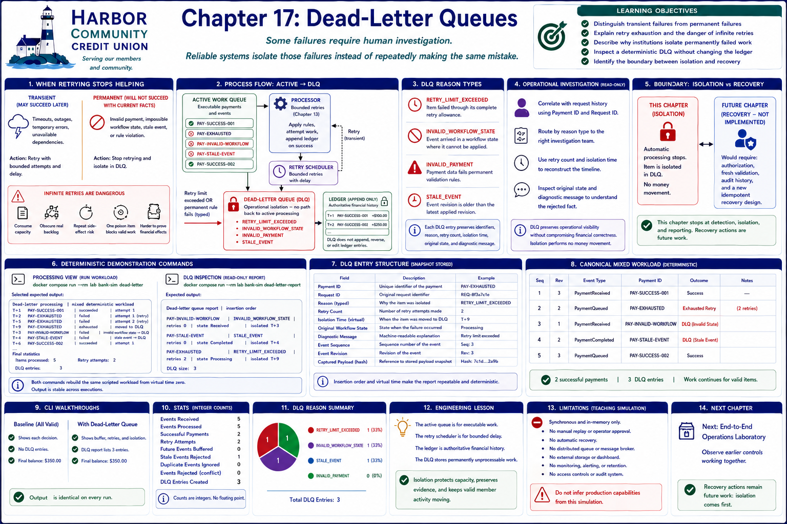

# Chapter 17: Dead-Letter Queues



## Learning objectives

By the end of this chapter, you will be able to:

- distinguish transient failures from permanent failures;
- explain retry exhaustion and the danger of infinite retries;
- describe why a financial institution isolates permanently failed operations;
- inspect a deterministic dead-letter queue (DLQ) without changing the ledger; and
- identify the boundary between isolation and a future operator recovery workflow.

## When retrying stops helping

Chapter 13 bounded retries so a temporary processor outage could clear without
creating a second financial effect. That policy also needs an answer for work that
never succeeds. **Retry exhaustion** occurs after the configured number of retries
has been consumed. Another attempt would repeat the same operational risk without
adding new information.

A timeout or unavailable dependency may be *transient*. An invalid payment, an
impossible workflow transition, or a stale event is *permanent* for the facts the
system currently has. Retrying a permanent failure cannot repair those facts.

Infinite retries are dangerous because they consume capacity, obscure real backlog,
repeat side-effect risk, and allow one poison item to compete forever with valid
payments. For a financial institution, that threatens timely processing and makes
it harder to prove which operations did—and did not—affect member balances.

## The dead-letter queue

A dead-letter queue is an operational isolation area. Once the retry limit is
exceeded, or a typed permanent rule fails, the processor removes the item from
active work and appends a diagnostic snapshot to the DLQ. This laboratory supports:

- `RETRY_LIMIT_EXCEEDED`;
- `INVALID_WORKFLOW_STATE`;
- `INVALID_PAYMENT`; and
- `STALE_EVENT`.

Each entry preserves the payment and original request identifiers, reason, retry
count, isolation time, original workflow state, and a diagnostic message. Insertion
order and virtual time make the report repeatable. The DLQ does not append, reverse,
or edit ledger entries. It also has no path back to active processing.

That separation answers the business question: institutions keep permanently
failed operations away from normal payment traffic so valid member activity can
continue while investigators retain a precise record of what needs attention. It
answers the engineering question: a DLQ terminates automatic attempts, isolates a
poison item, and preserves evidence, while infinite retrying continuously spends
capacity and risks repeating effects.

## Operational investigation

An operator could use the stored identifiers to correlate request history, the
typed reason to route an investigation, the retry count and time to reconstruct the
timeline, and the captured state and diagnostic to understand the rejected fact.
The DLQ preserves operational visibility without compromising financial
correctness: payment history remains inspectable, but isolation itself performs no
money movement.

This chapter intentionally stops there. Reading a report is not approval to replay
work. Safe replay would need authorization, fresh validation, audit history, and a
new idempotent recovery design.

## Try the command line

From the Dev Container terminal:

The scenario mixes two successful payments with three permanent failures. One
payment fails through its complete retry allowance. A completed event arriving from
an invalid workflow state and a stale revision fail immediately. Successful work
continues, while each failed item appears once in insertion order in the DLQ.

Run the processing view:

```bash
bank-sim dead-letter
```

Selected expected output:

```text
Dead-letter processing | mixed deterministic workload
T+1 PAY-SUCCESS-001 | succeeded | attempt 1
...
Final statistics
Items processed: 5
Successful payments: 2
Retry attempts: 2
DLQ entries: 3
```

Then inspect the isolated records:

```bash
bank-sim dead-letter-report
```

Expected output:

```text
Dead-letter queue report | insertion order
PAY-INVALID-WORKFLOW | INVALID_WORKFLOW_STATE | retries 0 | state Received | isolated T+3
PAY-STALE-EVENT | STALE_EVENT | retries 0 | state Completed | isolated T+4
PAY-EXHAUSTED | RETRY_LIMIT_EXCEEDED | retries 2 | state Processing | isolated T+9
DLQ size: 3
```

Both commands rebuild the same scripted workload from virtual time zero, so their
output is stable across executions. The metrics use integer counts: items processed,
successful payments, retry attempts, entries and reason counts, active queue size,
and DLQ size.

## Engineering lesson

**Some failures require human investigation. Reliable systems isolate those
failures instead of repeatedly making the same mistake.**

The active queue remains responsible for executable work, retry scheduling remains
responsible for bounded delay, the ledger remains authoritative financial history,
and the DLQ stores only permanently unprocessable work. This narrow ownership keeps
the safety mechanism understandable.

## Limitations and next step

The simulation is synchronous and in memory. It provides no manual replay,
operator approval, automatic recovery, distributed queue, message broker, external
storage, dashboard, monitoring, or alerting. It does not model retention or access
controls. Those concerns must not be inferred from this teaching implementation.

The next step is the end-to-end laboratory, where the earlier controls can be
observed together. Recovery actions remain future work: isolation comes before a
carefully authorized recovery design.

## Debugging Laboratory

### Goal

Observe permanently unprocessable work leaving the active retry path.

### Open the Source

Open `src/bank_sim/dead_letters.py` and find `DeadLetterProcessor._isolate`. Follow calls into adjacent domain objects when stepping; this function is the chapter's clearest observation boundary.

### Set the Breakpoint

Set a breakpoint at the call to `self.dead_letters.isolate(entry)`. This logical operation is more stable than a line number and pauses immediately before the chapter's important state transition.

### Launch the Debugger

Select **Debug: Isolate Dead Letters** in **Run and Debug** and start it. The configuration runs the chapter's deterministic CLI scenario, so debugging exposes the same execution described above.

### Observe

Inspect `payment`, `reason`, `diagnostic`, `entry`, `payment.retry_count`, `payment.isolated`, and `self.dead_letters.entries`. Before stepping, expect the following: The failed payment is not yet isolated and the DLQ lacks its entry. Its reason and retry count explain whether it is invalid immediately or exhausted after bounded retries.

### Step Through

Step over construction and insertion of the `DeadLetterEntry`. The immutable entry appears in DLQ insertion order; then `payment.isolated` becomes true and a “moved to DLQ” result is recorded. Continue to compare immediate isolation with retry exhaustion.

### Engineering Observation

A DLQ stops poison work from consuming capacity or causing endless effects while preserving investigation context. Isolation is an operational safety boundary, not a ledger posting.
