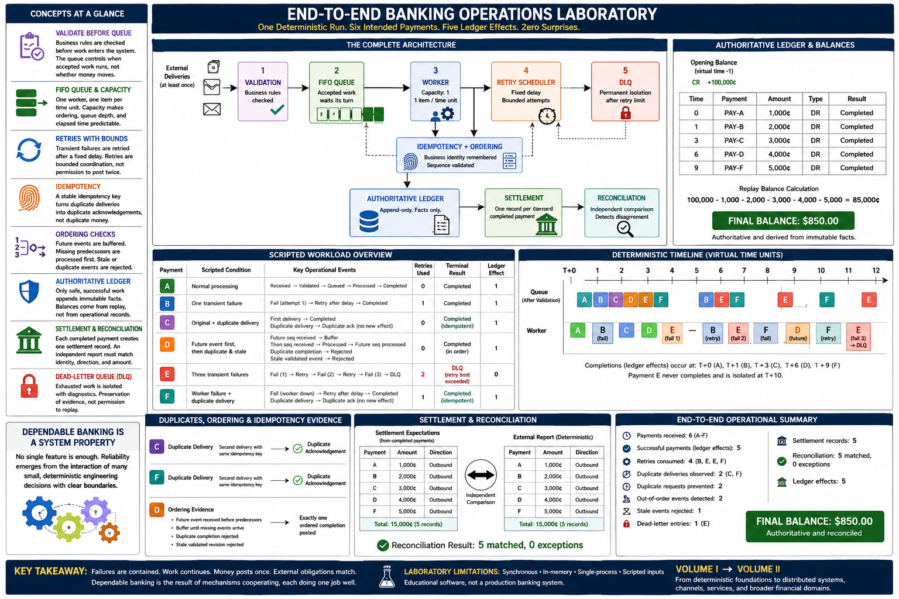

# Chapter 18: End-to-End Banking Operations Laboratory



## Learning objectives

By the end of this capstone, you will be able to:

- trace a payment from receipt and validation through completion or isolation;
- explain how queue capacity, retries, idempotency, and ordering checks cooperate;
- distinguish authoritative ledger facts from operational and settlement records;
- use deterministic statistics to verify operational and financial outcomes; and
- explain why dependable banking is a system property rather than one feature.

## The complete architecture

Volume I built the laboratory one small mechanism at a time. Chapter 3 made the
append-only ledger authoritative, and Chapter 4 derived balances from it. Chapters
8–10 separated external payment workflow, settlement, and independent
reconciliation. Chapters 11–13 introduced FIFO queues, bounded worker capacity,
and fixed-delay retries. Chapters 14–17 then addressed duplicate delivery,
idempotency, event ordering, and permanent isolation.

This chapter does not replace those demonstrations or introduce a new platform. It
composes their existing in-memory components around one virtual clock:

```text
requests -> validation -> FIFO queue -> one worker -> retry scheduling
                                      |              |
                                      v              v
                         idempotency + ordering      DLQ
                                      |
                                      v
                         authoritative ledger -> settlement -> reconciliation
```

Validation occurs before queue placement. The queue controls *when* accepted work
runs, not whether money should move. Idempotency establishes business identity,
and ordering establishes whether an event is the next usable fact. Only safe,
successful work appends to the ledger. Completed payments generate settlement
expectations, which are compared independently with an external report. Exhausted
work leaves active processing for the dead-letter queue (DLQ) without a ledger
effect.

## Scripted workload

The run receives six intended payments at virtual time zero. Every amount, failure,
delivery, event order, retry delay, and worker decision is fixed.

| Payment | Scripted condition | Terminal result | Ledger effects |
| --- | --- | --- | ---: |
| A | Normal processing | Completed | 1 |
| B | One transient processor failure | Completed after one retry | 1 |
| C | Original plus duplicate request delivery | Completed idempotently | 1 |
| D | Future event first, then duplicate and stale events | Completed in order | 1 |
| E | Three scripted transient failures | DLQ after two retries | 0 |
| F | Worker failure plus duplicate delivery | Completed idempotently after retry | 1 |

Payment F matters because operational conditions do not arrive in neatly isolated
chapters. Its retry policy determines when work resumes, while its idempotency key
determines whether two deliveries mean two financial operations. Each mechanism
retains its narrow responsibility.

## Walking through the lifecycle

### Receipt, validation, and queueing

The six business requests are validated and accepted before being placed in the
Chapter 11 FIFO queue. One Chapter 12-style worker processes one item per simulated
time unit. The fixed capacity makes queue depth, assignment order, and elapsed time
repeatable. Duplicate deliveries are transport observations, not additional
intended payments, so the operational total remains six.

### Retry scheduling and worker continuity

Payments B and F fail once. Their work is rescheduled after the fixed delay, and
other queued payments continue instead of blocking behind them. Payment E uses its
two-retry allowance and fails on its third attempt. B and F eventually append one
effect each; E never invokes its financial callback.

This combines Chapter 13's distinction between an *attempt* and a *business
effect* with Chapter 17's terminal boundary. B, E, and F consume four retries in
total. Retry is bounded operational coordination—not permission to post twice.

### Duplicate requests and idempotency

Payments C and F each arrive twice under one stable idempotency key. The first
delivery stores the completed result and creates the debit. The second returns that
result and records a duplicate acknowledgement. Thus two duplicate deliveries are
prevented from becoming two duplicate financial effects.

This is the safe answer to the failure exposed by Chapter 14. Delivery is commonly
at least once; the business effect must still occur exactly once in this scripted,
single-process model.

### Ordering validation

Payment D's queued event arrives before its received and validated events. The
Chapter 16 processor buffers future sequences, processes the missing predecessors,
and drains the buffer in workflow order. A second future event is also detected.
After completion, a duplicate completion is rejected and a late validated revision
is classified as stale. Exactly one ordered settlement debit reaches the ledger.

### Ledger and balances

The ledger begins with an exact 100,000-cent opening credit. The five successful
payments debit 1,000, 2,000, 3,000, 4,000, and 5,000 cents. Replay derives:

```text
100,000 - 1,000 - 2,000 - 3,000 - 4,000 - 5,000 = 85,000 cents
```

The DLQ entry, retry records, duplicate acknowledgements, queue events, and
ordering decisions are operational evidence; none pretends to be financial
history. The final `$850.00` balance comes only from replaying immutable ledger
facts.

### Settlement and reconciliation

Each of the five successful payments creates one outbound settlement expectation.
The deterministic external report carries the same identity, direction, and
integer-cent amount. Independent reconciliation matches all five records with zero
exceptions and matching totals. Payment E creates no settlement expectation,
because an isolated operation never completed financially.

### Permanent isolation

Payment E enters the DLQ once with `RETRY_LIMIT_EXCEEDED`, retry count two, its
processing state, virtual isolation time, and diagnostic. Normal work has already
continued around its retries. As Chapter 17 emphasized, isolation preserves
evidence but does not authorize replay or modify the ledger.

## Run the laboratory

Install the project, then print the full timeline:

```bash
docker compose run --rm lab bank-sim laboratory
```

Selected expected output:

```text
End-to-End Banking Operations Laboratory
Receiving payments
T+0 PAY-A..PAY-F | received, validated, and placed in FIFO queue
...
Final operational summary
Payments received: 6
Successful payments: 5
Retries: 4
Duplicate deliveries: 2
Duplicate requests prevented: 2
Out-of-order events detected: 2
Stale events: 1
Dead-letter entries: 1
Settlement records: 5
Reconciliation: 5 matched, 0 exceptions
Ledger effects: 5
Final balance: $850.00
```

For a concise operating report, run:

```bash
docker compose run --rm lab bank-sim operational-summary
```

Selected expected output:

```text
Operational Summary | deterministic end-to-end workload
Throughput: 5 completions / 12 time units (0.41 per unit)
...
Settlement: 5 records | reconciliation: 5 matched, 0 exceptions
Ledger: 5 payment effects | final balance $850.00 | authoritative and reconciled
```

Each command constructs a fresh scenario. Repeated executions therefore have
identical event order, statistics, balances, and text output.

## Volume I engineering lessons

The business answer is now visible: the institution continues correctly during
simultaneous operational problems because failures are contained. Capacity is
bounded, transient work waits, duplicate identity is remembered, future events are
buffered, stale facts are rejected, permanent failures are isolated, and financial
results are independently checked.

The engineering answer is composition. No component is responsible for everything:

- the virtual clock and scheduler make causality reproducible;
- the queue and worker make capacity explicit;
- retries provide bounded recovery from transient failure;
- idempotency separates deliveries from intended operations;
- ordering checks protect workflow progression;
- the ledger remains the sole authority for posted money;
- settlement records describe external obligations;
- reconciliation detects disagreement; and
- the DLQ removes poison work while retaining investigation context.

**Reliability emerges from the interaction of many small, deterministic
engineering decisions—not from any single feature.** A retry policy without
idempotency could duplicate money. Idempotency without ordering could accept the
wrong state. A correct ledger without reconciliation could leave an external
disagreement unnoticed. Their boundaries and interactions produce the dependable
result.

## Laboratory limitations

This remains educational software. It is synchronous, in memory, single-process,
and driven by scripted inputs. It has no database, distributed deployment,
external API, authentication, fraud detection, card or wire processing, machine
learning, dashboard, manual DLQ recovery, security controls, or production
compliance model. A matched simulated report does not represent a real payment
network or institution.

## Preview of Volume II

Volume II can extend the same disciplined approach into digital banking channels
and distributed financial systems: durable messaging, service boundaries,
observability, controlled recovery, and broader account lifecycle exercises.
Later volumes may address lending, fraud, analytics, and other domains. Those
topics should preserve Volume I's central habits: exact money, explicit state,
narrow ownership, deterministic tests, and independent verification.
